# Báo cáo review kiến trúc database ERP

Ngày review: 2026-07-20  
Phạm vi: toàn bộ `prisma/schema.prisma`, tập trung mua hàng thường/TERM, kho, ownership, availability, movement, reconciliation, logistics, payment, pricing, costing và khả năng mở rộng sang bán hàng.

> Kết luận ngắn: schema hiện tại bao phủ khá rộng nghiệp vụ nhưng lõi tồn kho không đủ an toàn để tiếp tục mở rộng. Nên giữ các master và workflow ngoại vi còn hợp lý, nhưng thiết kế lại toàn bộ lõi Warehouse/Inventory/Availability/Movement/Reconciliation/Costing theo mô hình ledger duy nhất có owner và lot. Không nên tiếp tục vá thêm field vào `InventoryBalance` hoặc `WarehouseAvailabilityBalance`.

## 1. Đánh giá tổng thể

### 1.1 Kết luận kiến trúc

- Mức độ bao phủ nghiệp vụ: khá, đặc biệt ở Purchase TERM, vận hành tàu, pricing và ngân hàng.
- Mức độ toàn vẹn dữ liệu: thấp ở lõi inventory/costing/payment vì thiếu khóa nguồn, idempotency và kiểm soát concurrency.
- Aggregate boundary: đang bị trộn. `PurchaseOrder` chứa cả commercial và TERM; `GoodsReceipt` vừa header vừa line; `SupplierLocation` vừa là kho vừa là địa điểm NCC; `InventoryBalance` trộn physical/document/accounting; `WarehouseAvailabilityBalance` trộn on-hand/expected/in-transit/reserved.
- Source of truth: không duy nhất. `InventoryLedger` và `WarehouseAvailabilityLedger` cùng phản ánh một phần tồn nhưng có dimension khác nhau; một bên không có owner, bên kia lại chứa cả expected/in-transit.
- Khả năng audit: chưa đạt. Nhiều chứng từ đã post vẫn có thể bị cascade delete; pricing FINAL và cost layer có thể bị xóa rồi tạo lại; cost consumption không có dòng lịch sử.
- Khả năng mở rộng sales/P&L theo lô: chưa đạt vì ledger không có `inventoryLotId`, cost layer không có consumption ledger và reservation không chỉ rõ owner/lô.

Quyết định đề xuất: **redesign lõi kho theo kiến trúc v2 chạy song song**, không refactor trực tiếp từng field trên schema cũ. Các bounded context Purchase, Logistics, AP và Pricing được refactor quanh lõi mới; Auth, HR, jobs và price master có thể giữ rồi chỉnh dần.

### 1.2 Phần nên giữ, refactor hoặc đập bỏ

| Nhóm hiện tại | Quyết định | Lý do / hướng xử lý |
|---|---|---|
| `DocumentSequence`, Cron/Background Job | Giữ, refactor nhẹ | Thêm `legalEntityId`, relation thật cho artifact/run, idempotency của job |
| `User`, `Employee`, `Area`, `Site`, `Department`, RBAC | Giữ | Chuẩn hóa enum, FK actor; thay `scopeType/scopeId` bằng scope có relation ở phase sau |
| `Customer*`, `CustomerOperationalRole` | Đập bỏ cấu trúc hiện tại | Thay bằng `Party` + role theo thời gian; bỏ `partyType` + 3 boolean + 2 mảng role đang có thể mâu thuẫn |
| `Contract*` | Refactor lớn | Tách commercial contract có version khỏi hợp đồng chuyên ngành tàu/kho; posted version immutable |
| `Product` | Giữ root, refactor | `code` bắt buộc unique; chuẩn hóa UOM, V15 policy, active/version |
| `SupplierLocation` | Đập bỏ vai trò “kho” | Tách `Warehouse` vật lý khỏi operator/lessor/supplier; bỏ tank khỏi identity kho |
| `PurchaseOrder`, `PurchaseOrderLine` | Giữ aggregate root, refactor lớn | Tách `TermPurchaseProfile`; bỏ total/withdrawn là source; thêm legal entity, currency, version, lineNo |
| `PurchaseTermOrderDocument*` | Giữ như snapshot | Version immutable, FK product thật, unique version/source hash |
| TERM payment request/batch/instruction | Refactor | Chỉ là payment workflow; không thay thế AP open item/payment allocation |
| `TermShipment`, `ShipCharter*`, `StorageRental*`, road transport | Giữ domain, refactor | Dùng `Party`, `Warehouse`, `PurchaseShipment`; chuẩn hóa QtyBasis/UOM/currency và cost source typed |
| `TermLogisticsCost*` | Refactor lớn | Thành cost document + allocation; posted immutable; bỏ `operationsSourceType/sourceId` generic |
| `GoodsReceipt` | Đập bỏ cấu trúc hiện tại | Thay header + lines; mỗi line tạo lot; post bằng `InventoryPosting` |
| `InventoryBalance`, `InventoryLedger` | Đập bỏ và thay mới | Ledger mới có owner + lot + actual/V15 + idempotent posting; balance chỉ projection |
| `WarehouseAvailabilityBalance/Ledger` | Đập bỏ và thay mới | Reservation, pending release, block là ba aggregate riêng; expected và transit nằm ngoài availability |
| `ExpectedInventory*` | Refactor lớn | `ExpectedSupply` có typed FK đến PO/shipment/movement và allocation đến receipt line |
| `WarehouseReservation` | Đập bỏ cấu trúc hiện tại | Header/line/event; hỗ trợ partial release/consume, owner và optional lot |
| `WarehouseTransfer*` | Đập bỏ cấu trúc hiện tại | Movement + Dispatch + Arrival; hỗ trợ partial, in-transit có chứng từ chi tiết |
| `ReconcileSession/Line/Variance` | Đập bỏ cấu trúc hiện tại | Thiếu file version, raw row, mapping, owner, ERP snapshot và resolution |
| `InventoryAdjustment*` | Refactor lớn | Posted document immutable, typed posting/reversal, owner + lot + dual quantity |
| `InventorySnapshot*` | Bỏ làm source | Có thể giữ snapshot kỹ thuật để tăng tốc; lịch sử chuẩn phải dựng từ ledger |
| `SupplierInvoice*`, `SupplierSettlement`, `PaymentAllocation` | Refactor lớn | AP open-item/subledger; allocation append-only/reversible; currency và locking đầy đủ |
| `PurchasePricingRun/Stage/*` | Giữ ý tưởng, refactor lớn | Mỗi run có version; FINAL không được delete/rebuild; input/output snapshot immutable |
| `InventoryCostLayer` | Đập bỏ cấu trúc hiện tại | Thay lot + cost layer projection + cost ledger/allocation append-only |
| Quotes, FX, tax, price bulletin/region | Giữ, refactor nhẹ | Chuẩn hóa effective period, precision, source/version và chống overlap |
| `AuditLog`, Import/Export jobs | Giữ, refactor | Audit append-only; actor FK; import file/version/checksum là model dùng chung |

## 2. Vấn đề P0/P1/P2

### 2.1 P0 - có thể làm sai tồn, giá vốn hoặc tiền

| ID | Hiện trạng | Rủi ro và ví dụ lỗi | Giải pháp đề xuất |
|---|---|---|---|
| P0-01 | `InventoryLedger` không có owner/lot; `WarehouseAvailabilityLedger` có owner nhưng lại là ledger thứ hai | Tồn vật lý 1.000 lít có thể được backfill toàn bộ thành hàng công ty dù thực tế 400 lít thuộc khách; hàng khách bị bán nhầm | Một stock ledger duy nhất có `warehouseId + productId + ownerPartyId + inventoryLotId`; physical là tổng theo owner, ownership là cùng ledger lọc theo owner |
| P0-02 | `InventoryService.applyDeltaAndAppendLedger` đọc balance rồi update giá trị tuyệt đối, không row lock, không unique idempotency | Hai receipt đồng thời cùng đọc 100, cùng ghi 150; ledger có +50 hai lần nhưng balance chỉ 150 thay vì 200 | `InventoryPosting.idempotencyKey` unique; lock balance theo thứ tự khóa; atomic increment/CAS version; ledger + balance trong một transaction |
| P0-03 | Confirm/void/status transition thường read-then-update không điều kiện | Hai request cùng confirm một receipt DRAFT, cùng tăng `withdrawnQty`, tồn và ledger hai lần | `UPDATE ... WHERE status = DRAFT AND version = ?`; chỉ request update được 1 row mới được post |
| P0-04 | `InventoryBalance` không chặn `physicalQty < 0`, không chặn `pendingDocQty + postedQty` lệch physical | Transfer/void cạnh tranh có thể tạo physical âm hoặc document buckets lớn hơn tồn | DB CHECK, deferred constraint trigger và rebuild validator; không dùng ba cột này làm source mới |
| P0-05 | Availability trộn `available/reserved/inTransit/expected`, thiếu pending release và blocked | Expected bị nhìn như balance kho; không thể chứng minh `onHand = free + reserved + pending + blocked` | Tách ExpectedSupply, Movement, Reservation, PendingRelease, InventoryBlock; projection availability chỉ chứa on-hand và ba bucket giảm khả dụng |
| P0-06 | `ownerType + ownerKey + ownerCustomerId` là ba cách biểu diễn cùng owner | Direct SQL có thể ghi owner CUSTOMER A nhưng `ownerKey` CUSTOMER B; unique và báo cáo sai | Chỉ dùng `ownerPartyId` FK; công ty cũng là một Party qua `LegalEntity.partyId` |
| P0-07 | Ledger/source/cost dùng `sourceType/sourceId` generic không FK | Xóa/chọn nhầm UUID nguồn vẫn để ledger “hợp lệ”; expected có thể allocate nhầm source cùng UUID | Typed FK từ posting/document; DB CHECK exactly-one source; generic reference chỉ được dùng cho audit/search, không dùng cho số liệu |
| P0-08 | Pricing FINAL xóa cost layer và stage cũ; consume layer không lưu consumption, không lock | Run FINAL lại có thể xóa layer đã dùng; hai đơn bán đồng thời cùng consume một layer nhưng chỉ trừ một lần | Posted pricing immutable, run correction/supersede; `CostLayerEntry` append-only và `CostAllocation` M:N có idempotency + row lock |
| P0-09 | Payment allocation đọc remaining rồi cộng, transaction ngân hàng được đọc ngoài transaction | Hai request có thể phân bổ một bank transaction cho hai bộ công nợ vượt số tiền | Lock bank transaction và open items; allocation/reversal append-only; constraint tổng allocation không vượt tiền bằng deferred trigger |
| P0-10 | Nhiều quan hệ lịch sử dùng cascade delete (`InventoryLedger`, availability ledger, invoice line, allocation, pricing) | Xóa master/chứng từ cha có thể xóa bằng chứng đã post, làm balance không rebuild được | `onDelete: Restrict` cho mọi financial/stock/history row; draft mới được hard delete; posted chỉ reverse/void |

### 2.2 P1 - sai boundary, khó mở rộng hoặc mất audit

| ID | Hiện trạng | Rủi ro / ví dụ | Giải pháp đề xuất |
|---|---|---|---|
| P1-01 | `SupplierLocation` vừa là kho, vừa thuộc NCC, vừa chứa tank | Đổi operator/lessor có thể buộc tạo “kho mới”, làm đứt lịch sử cùng một kho vật lý | `Warehouse` độc lập; bảng assignment operator/lessor theo thời gian |
| P1-02 | `Customer` có `partyType`, `isCustomer/isSupplier/isInternal`, `roles`, `operationalRoles` | Một party có thể vừa `partyType=CUSTOMER`, `isSupplier=true`, role không đồng bộ | `Party` + `PartyRole(validFrom, validTo)`; role là source duy nhất |
| P1-03 | `PurchaseOrder` chứa field commercial và TERM; `TermShipment` lại lặp vessel text/master | Nhiều nullable field, rule theo loại nằm ở service, khó version contract/pricing | PO chung + `TermPurchaseProfile` 1:1; shipment riêng, snapshot field được đặt tên rõ |
| P1-04 | `GoodsReceipt` là một sản phẩm trên header | Một phiếu nhiều mặt hàng phải bị tách thành nhiều receipt, số chứng từ và trạng thái lặp | `GoodsReceipt` header + `GoodsReceiptLine`; ledger post theo line |
| P1-05 | Không có inventory lot xuyên suốt receipt -> transfer -> sale | Không thể FIFO/manual allocation hay P&L theo lô chính xác | Tạo `InventoryLot` từ receipt line; mọi stock entry giữ `inventoryLotId` |
| P1-06 | Reconciliation chỉ có một file/session và line tổng theo product | Không lưu raw row, mapping, owner detail, file thay thế hay snapshot ERP đúng thời điểm | Thiết kế lại session/file/raw/normalized/snapshot/variance/resolution; checksum idempotent |
| P1-07 | `SupplierInvoice` vừa có create-as-POSTED vừa có DRAFT->post; invoice qty chỉ kiểm pending tổng | Một GR có thể bị invoiced lặp qua nhiều line/invoice; duplicate rule app và DB không đồng nhất | Invoice immutable after post; allocation invoice line -> receipt line; unique/idempotent posting và AP subledger |
| P1-08 | Accounting stock được lưu như `postedQty` trong operational balance | Hạch toán chứng từ làm thay đổi bucket tồn thay vì ghi nhận trạng thái accounting/cost của lot | Physical ledger độc lập; accounting view từ lot recognition/cost/AP subledger |
| P1-09 | Không có `LegalEntity` trên chứng từ và tồn | Mở thêm công ty/pháp nhân sẽ trộn owner INTERNAL, sequence, PO và bank | Thêm `LegalEntity`; công ty sở hữu hàng là party tương ứng của legal entity |
| P1-10 | Quantity/money/rate precision không thống nhất, nhiều `Decimal` không native precision, rate khi 5.2 khi 18.6 | Sai rounding, percent hiểu là 5 hay 0.05, unit price TERM và thường lệch precision | Quantity 24,6; unit price/FX 24,8/24,10; money 24,4; rate quy ước 0..1 và CHECK |
| P1-11 | Expected source generic; allocation auto không lọc owner/sourceType đầy đủ | Receipt hàng công ty có thể bù expected của khách nếu cùng kho/product/source id | Typed source + owner/warehouse/product match bắt buộc trong allocation |
| P1-12 | Logistics cost có status ALLOCATED/POSTED nhưng service mới chủ yếu confirm/void | Chi phí vận hành không có nguồn phân bổ cuối cùng vào lot, giá vốn thiếu hoặc tính lặp | Cost document -> cost allocation -> cost layer entry, mỗi bước có version và idempotency |

### 2.3 P2 - chuẩn hóa và khả năng vận hành

| ID | Hiện trạng | Đề xuất |
|---|---|---|
| P2-01 | Enum trộn `UPPER_CASE`, `PascalCase`, `lowercase` | Chuẩn hóa DB enum `UPPER_SNAKE_CASE`; API tự map nhãn tiếng Việt |
| P2-02 | Timestamp phần lớn không ghi rõ timezone | Business date dùng `@db.Date`; event/audit dùng `@db.Timestamptz(6)` |
| P2-03 | `createdBy/updatedBy/confirmedBy/userId` nhiều nơi không có FK | Dùng actor FK `User` với `onDelete: Restrict/SetNull` theo loại dữ liệu |
| P2-04 | File metadata lặp ở nhiều model | Dùng `StoredFile` + `DocumentAttachment`; nghiệp vụ cần version thì có bảng version riêng |
| P2-05 | Soft delete không nhất quán | Chỉ master data được archive; transaction không soft/hard delete sau post |
| P2-06 | Effective period không chống overlap | Exclusion constraint cho tax/rate/contract term theo key và daterange |
| P2-07 | `JobArtifact.runId`, audit entity và RBAC scope thiếu relation | Thêm relation nếu ảnh hưởng integrity; audit entity polymorphic được phép vì không phải source nghiệp vụ |
| P2-08 | `Product.code` nullable/non-unique | Bắt buộc unique theo legal entity/catalog; alias NCC để mapping reconciliation |

## 3. Aggregate boundary mục tiêu

| Bounded context | Aggregate root | Thành phần sở hữu bên trong | Không được cập nhật trực tiếp từ context khác |
|---|---|---|---|
| Party | `Party` | role, address, contact, identifiers | Role/identity của party |
| Organization | `LegalEntity` | sequence policy, base currency | Internal owner identity |
| Contract | `CommercialContract` + immutable version | terms, lines, attachments | Version đã active/signed |
| Purchase | `PurchaseOrder` | lines, approval, TERM profile | Ordered quantity/status |
| Purchase TERM | `PurchasePricingRun` | stages, inputs, outputs | Run POSTED; correction tạo version mới |
| Inbound logistics | `PurchaseShipment` | shipment lines, schedules, charter links | ETA/ETD/status shipment |
| Receipt | `GoodsReceipt` | receipt lines, source file | POSTED/VOIDED state; post gọi Inventory context |
| Warehouse master | `Warehouse` | operator/lessor assignments | Identity kho vật lý |
| Inventory | `InventoryPosting` | append-only ledger entries | Ledger; chỉ posting service được ghi |
| Inventory lot | `InventoryLot` | origin/trace identity | Lot origin; movement không đổi lot |
| Availability | `InventoryReservation`, `InventoryPendingRelease`, `InventoryBlock` | lines/events của từng loại | Không dùng một status/table chung cho ba khái niệm |
| Movement | `InventoryMovement` | lines, dispatches, arrivals | In-transit state và chứng từ dispatch/arrival |
| Ownership | `OwnershipTransfer` | lines/posting | Chuyển owner, net physical bằng 0 |
| Expected | `ExpectedSupply` | typed source, receipt allocations | Expected/fulfilled quantity |
| Reconciliation | `WarehouseReconciliation` | file versions, raw rows, mapping, snapshot, variance, resolution | File không tự sửa ledger |
| Logistics cost | `LandedCostDocument` | lines, allocations | Cost đã post |
| AP | `SupplierInvoice`, `PayableOpenItem` | invoice lines, AP entries | Công nợ posted |
| Payment | `BankTransaction`, `PaymentAllocation` | allocation/reversal | Cash transaction và allocation history |
| Costing | `InventoryCostLayer` | append-only cost entries | Remaining quantity/value là projection |
| Sales mở rộng | `SalesOrder`, `SalesDelivery` | lines, reservation/delivery refs | Không nhét sales vào inventory balance |

Nguyên tắc phụ thuộc: Purchase/Logistics/Sales phát sinh chứng từ; Inventory nhận command post/reverse và trả về `InventoryPosting`. Không module nào được update `InventoryBalance` trực tiếp. Reconciliation chỉ tạo block hoặc adjustment document; Costing nghe posting/lot và tạo cost entries trong cùng transaction hoặc qua outbox idempotent.

## 4. Source-of-truth matrix

| Chỉ tiêu | Source of truth | Projection/cache | Cách kiểm tra |
|---|---|---|---|
| Tồn tại kho | Sum `InventoryLedgerEntry` theo warehouse/product/lot/owner | `InventoryBalance` | Rebuild sum ledger = balance |
| Tồn từng chủ sở hữu | Cùng stock ledger, group `ownerPartyId` | Cùng balance | Tổng owner = physical do physical chính là tổng owner |
| Hàng khả dụng | On-hand ledger trừ event active của reservation, pending release, block | `InventoryAvailabilityBalance` | `available = onHand - reserved - pending - blocked` |
| Hàng đã giữ | `InventoryReservationEvent` | reserved bucket | Reserve - release - consume = active |
| Chưa được xuất | `InventoryPendingReleaseEvent` | pending bucket | Open - release/cancel = active |
| Bị chặn | `InventoryBlockEvent` | blocked bucket | Block - unblock = active |
| Đang luân chuyển | Posted dispatch lines trừ posted arrival lines | Movement summary | Không nằm balance kho nguồn/đích |
| Dự kiến | `ExpectedSupply` và allocation đến receipt line | Expected dashboard | Expected - allocated = open |
| Tồn kế toán | Accounting/cost subledger theo lot | Accounting inventory view | Rebuild journal/cost entries; không đọc `postedQty` |
| Chênh lệch đối chiếu | Immutable supplier normalized line + ERP snapshot line | Variance summary | Variance = supplier snapshot - ERP snapshot |
| Giá mua | Contract/PO price + posted supplier invoice correction | Purchase price view | Invoice/contract version trace |
| Giá vốn | Cost layer entries + landed-cost allocations | Cost layer remaining/value | Rebuild cost layer from entries |
| Thanh toán | Confirmed bank transaction + payment allocation entries | Payment summary | Allocation active <= bank txn amount |
| Công nợ | AP open-item ledger | outstanding balance | Original +/- AP entries = outstanding |
| Lãi/lỗ theo lô/đơn bán | Sales revenue + `CostAllocation` từ delivery line đến cost layer | P&L mart | M:N trace delivery line <-> purchase lot |

## 5. Sơ đồ database mục tiêu

```mermaid
erDiagram
    PARTY ||--o{ PARTY_ROLE : has
    PARTY ||--o| LEGAL_ENTITY : represents
    LEGAL_ENTITY ||--o{ WAREHOUSE : manages
    PARTY ||--o{ PURCHASE_ORDER : supplier
    PURCHASE_ORDER ||--|{ PURCHASE_ORDER_LINE : contains
    PURCHASE_ORDER ||--o| TERM_PURCHASE_PROFILE : specializes
    PURCHASE_ORDER ||--o{ PURCHASE_SHIPMENT : schedules
    PURCHASE_SHIPMENT ||--|{ PURCHASE_SHIPMENT_LINE : carries
    PURCHASE_ORDER_LINE ||--o{ EXPECTED_SUPPLY : plans
    PURCHASE_SHIPMENT_LINE ||--o{ EXPECTED_SUPPLY : plans

    GOODS_RECEIPT ||--|{ GOODS_RECEIPT_LINE : contains
    GOODS_RECEIPT_LINE ||--|| INVENTORY_LOT : creates
    EXPECTED_SUPPLY ||--o{ EXPECTED_SUPPLY_ALLOCATION : fulfilled_by
    GOODS_RECEIPT_LINE ||--o{ EXPECTED_SUPPLY_ALLOCATION : fulfills

    INVENTORY_POSTING ||--|{ INVENTORY_LEDGER_ENTRY : posts
    INVENTORY_LOT ||--o{ INVENTORY_LEDGER_ENTRY : traces
    WAREHOUSE ||--o{ INVENTORY_LEDGER_ENTRY : locates
    PARTY ||--o{ INVENTORY_LEDGER_ENTRY : owns
    INVENTORY_LEDGER_ENTRY }o--|| INVENTORY_BALANCE : projects

    INVENTORY_RESERVATION ||--|{ INVENTORY_RESERVATION_LINE : contains
    INVENTORY_RESERVATION_LINE ||--o{ INVENTORY_RESERVATION_EVENT : changes
    INVENTORY_PENDING_RELEASE ||--o{ INVENTORY_PENDING_RELEASE_EVENT : changes
    INVENTORY_BLOCK ||--o{ INVENTORY_BLOCK_EVENT : changes
    INVENTORY_AVAILABILITY_BALANCE }o--|| INVENTORY_BALANCE : summarizes

    INVENTORY_MOVEMENT ||--|{ INVENTORY_MOVEMENT_LINE : contains
    INVENTORY_MOVEMENT ||--o{ INVENTORY_DISPATCH : dispatches
    INVENTORY_DISPATCH ||--|{ INVENTORY_DISPATCH_LINE : contains
    INVENTORY_MOVEMENT ||--o{ INVENTORY_ARRIVAL : receives
    INVENTORY_ARRIVAL ||--|{ INVENTORY_ARRIVAL_LINE : contains

    WAREHOUSE_RECONCILIATION ||--o{ RECONCILIATION_FILE : versions
    RECONCILIATION_FILE ||--o{ RECONCILIATION_RAW_ROW : imports
    RECONCILIATION_RAW_ROW ||--o| RECONCILIATION_NORMALIZED_LINE : normalizes
    WAREHOUSE_RECONCILIATION ||--o{ RECONCILIATION_ERP_SNAPSHOT_LINE : snapshots
    WAREHOUSE_RECONCILIATION ||--o{ RECONCILIATION_VARIANCE : compares
    RECONCILIATION_VARIANCE ||--o{ RECONCILIATION_RESOLUTION : resolves

    INVENTORY_LOT ||--o{ INVENTORY_COST_LAYER : costs
    INVENTORY_COST_LAYER ||--o{ COST_LAYER_ENTRY : changes
    SALES_DELIVERY_LINE ||--o{ COST_LAYER_ENTRY : consumes
    LANDED_COST_DOCUMENT ||--|{ LANDED_COST_LINE : contains
    LANDED_COST_LINE ||--o{ LANDED_COST_ALLOCATION : allocates
    INVENTORY_LOT ||--o{ LANDED_COST_ALLOCATION : receives_cost

    SUPPLIER_INVOICE ||--|{ SUPPLIER_INVOICE_LINE : contains
    SUPPLIER_INVOICE ||--o| PAYABLE_OPEN_ITEM : creates
    PAYABLE_OPEN_ITEM ||--o{ PAYABLE_LEDGER_ENTRY : changes
    BANK_TRANSACTION ||--o{ PAYMENT_ALLOCATION : funds
    PAYABLE_OPEN_ITEM ||--o{ PAYMENT_ALLOCATION : settles
```



## 6. Prisma schema đề xuất

Đây là schema mục tiêu cho lõi ERP, không phải patch áp trực tiếp lên schema cũ. Các inverse array chỉ phục vụ navigation được lược bớt khi không ảnh hưởng constraint; khi triển khai phải bổ sung để `prisma validate` thành công. Quy ước:

- Quantity: `Decimal(24,6)`.
- Money: `Decimal(24,4)` kèm currency.
- Unit price: `Decimal(24,8)`.
- Rate: số thập phân từ `0..1`, `Decimal(12,10)`; UI tự đổi sang phần trăm.
- Business date: `@db.Date`; event timestamp: `@db.Timestamptz(6)`.
- Mọi model transaction có `version`; mọi thao tác post có `idempotencyKey` unique.
- Model posted/history dùng `onDelete: Restrict`; chỉ child của draft mới được cascade trong API, không dựa vào cascade DB.

### 6.1 Party, pháp nhân, sản phẩm và kho

```prisma
enum PartyKind {
  ORGANIZATION
  INDIVIDUAL
}

enum PartyRoleType {
  CUSTOMER
  SUPPLIER
  INTERNAL_COMPANY
  INVENTORY_OWNER
  WAREHOUSE_OPERATOR
  WAREHOUSE_LESSOR
  SHIP_OWNER
  SEA_CARRIER
  ROAD_CARRIER
  SURVEYOR
  SHIPPING_AGENT
  INSURER
}

enum MasterStatus {
  ACTIVE
  INACTIVE
  ARCHIVED
}

enum QuantityUom {
  LITER
  KILOGRAM
  UNIT
}

enum WarehousePartyRole {
  OPERATOR
  LESSOR
}

model Party {
  id         String       @id @default(dbgenerated("uuid_generate_v7()")) @db.Uuid
  code       String       @unique
  legalName  String
  taxCode    String?
  kind       PartyKind
  status     MasterStatus @default(ACTIVE)
  version    Int          @default(1)
  createdAt  DateTime     @default(now()) @db.Timestamptz(6)
  updatedAt  DateTime     @updatedAt @db.Timestamptz(6)

  roles PartyRole[]

  @@index([legalName])
  @@index([taxCode])
}

model PartyRole {
  id        String        @id @default(dbgenerated("uuid_generate_v7()")) @db.Uuid
  partyId   String        @db.Uuid
  role      PartyRoleType
  validFrom DateTime      @db.Date
  validTo   DateTime?     @db.Date
  createdAt DateTime      @default(now()) @db.Timestamptz(6)

  party Party @relation(fields: [partyId], references: [id], onDelete: Restrict)

  @@unique([partyId, role, validFrom])
  @@index([role, validFrom, validTo])
}

model LegalEntity {
  id           String   @id @default(dbgenerated("uuid_generate_v7()")) @db.Uuid
  code         String   @unique
  partyId      String   @unique @db.Uuid
  baseCurrency String   @db.Char(3)
  createdAt    DateTime @default(now()) @db.Timestamptz(6)

  party Party @relation(fields: [partyId], references: [id], onDelete: Restrict)
}

model Product {
  id          String       @id @default(dbgenerated("uuid_generate_v7()")) @db.Uuid
  code        String       @unique
  name        String
  baseUom     QuantityUom
  tracksV15   Boolean      @default(false)
  status      MasterStatus @default(ACTIVE)
  version     Int          @default(1)
  createdAt   DateTime     @default(now()) @db.Timestamptz(6)
  updatedAt   DateTime     @updatedAt @db.Timestamptz(6)

  @@index([name])
}

model ProductAlias {
  id              String   @id @default(dbgenerated("uuid_generate_v7()")) @db.Uuid
  productId       String   @db.Uuid
  partyId         String?  @db.Uuid
  externalCode    String?
  externalName    String
  normalizedName  String
  validFrom       DateTime @db.Date
  validTo         DateTime? @db.Date

  product Product @relation(fields: [productId], references: [id], onDelete: Restrict)
  party   Party?  @relation(fields: [partyId], references: [id], onDelete: Restrict)

  @@unique([partyId, normalizedName, validFrom])
  @@index([externalCode])
}

model Warehouse {
  id            String       @id @default(dbgenerated("uuid_generate_v7()")) @db.Uuid
  legalEntityId String       @db.Uuid
  code          String
  name          String
  address       String?
  timezone      String       @default("Asia/Ho_Chi_Minh")
  status        MasterStatus @default(ACTIVE)
  version       Int          @default(1)
  createdAt     DateTime     @default(now()) @db.Timestamptz(6)
  updatedAt     DateTime     @updatedAt @db.Timestamptz(6)

  legalEntity LegalEntity @relation(fields: [legalEntityId], references: [id], onDelete: Restrict)
  parties     WarehousePartyAssignment[]

  @@unique([legalEntityId, code])
  @@index([status, name])
}

model WarehousePartyAssignment {
  id          String             @id @default(dbgenerated("uuid_generate_v7()")) @db.Uuid
  warehouseId String             @db.Uuid
  partyId     String             @db.Uuid
  role        WarehousePartyRole
  validFrom   DateTime           @db.Date
  validTo     DateTime?          @db.Date

  warehouse Warehouse @relation(fields: [warehouseId], references: [id], onDelete: Restrict)
  party     Party     @relation(fields: [partyId], references: [id], onDelete: Restrict)

  @@unique([warehouseId, partyId, role, validFrom])
  @@index([warehouseId, role, validFrom, validTo])
}
```

### 6.2 Purchase thường, TERM, shipment, expected và receipt

```prisma
enum PurchaseKind {
  COMMERCIAL
  TERM
}

enum PurchaseOrderStatus {
  DRAFT
  PENDING_APPROVAL
  APPROVED
  IN_PROGRESS
  COMPLETED
  CANCELLED
}

enum TermTransportMode {
  PIPELINE
  SEA
  ROAD
}

enum GoodsReceiptStatus {
  DRAFT
  POSTED
  VOIDED
}

enum ExpectedSupplyStatus {
  OPEN
  PARTIALLY_FULFILLED
  FULFILLED
  CANCELLED
}

model PurchaseOrder {
  id              String              @id @default(dbgenerated("uuid_generate_v7()")) @db.Uuid
  legalEntityId   String              @db.Uuid
  orderNo         String
  supplierPartyId String              @db.Uuid
  kind            PurchaseKind
  status          PurchaseOrderStatus @default(DRAFT)
  currency        String              @db.Char(3)
  orderDate       DateTime            @db.Date
  expectedDate    DateTime?           @db.Date
  version         Int                 @default(1)
  approvedAt      DateTime?           @db.Timestamptz(6)
  approvedById    String?             @db.Uuid
  createdAt       DateTime            @default(now()) @db.Timestamptz(6)
  updatedAt       DateTime            @updatedAt @db.Timestamptz(6)

  legalEntity LegalEntity          @relation(fields: [legalEntityId], references: [id], onDelete: Restrict)
  supplier    Party                @relation(fields: [supplierPartyId], references: [id], onDelete: Restrict)
  lines       PurchaseOrderLine[]
  termProfile TermPurchaseProfile?
  shipments   PurchaseShipment[]

  @@unique([legalEntityId, orderNo])
  @@index([supplierPartyId, orderDate])
  @@index([status, expectedDate])
}

model TermPurchaseProfile {
  purchaseOrderId  String            @id @db.Uuid
  premiumUsdPerBbl Decimal?          @db.Decimal(24, 8)
  transportMode    TermTransportMode
  charterRequired  Boolean           @default(false)
  pricingPolicy    Json

  purchaseOrder PurchaseOrder @relation(fields: [purchaseOrderId], references: [id], onDelete: Restrict)
}

model PurchaseOrderLine {
  id                  String    @id @default(dbgenerated("uuid_generate_v7()")) @db.Uuid
  purchaseOrderId     String    @db.Uuid
  lineNo              Int
  productId           String    @db.Uuid
  receivingWarehouseId String?  @db.Uuid
  orderedActualQty    Decimal   @db.Decimal(24, 6)
  orderedV15Qty       Decimal?  @db.Decimal(24, 6)
  unitPrice           Decimal?  @db.Decimal(24, 8)
  taxRate             Decimal?  @db.Decimal(12, 10)
  note                String?

  purchaseOrder     PurchaseOrder @relation(fields: [purchaseOrderId], references: [id], onDelete: Restrict)
  product           Product       @relation(fields: [productId], references: [id], onDelete: Restrict)
  receivingWarehouse Warehouse?    @relation(fields: [receivingWarehouseId], references: [id], onDelete: Restrict)

  @@unique([purchaseOrderId, lineNo])
  @@index([productId])
  @@index([receivingWarehouseId, productId])
}

model PurchaseShipment {
  id              String   @id @default(dbgenerated("uuid_generate_v7()")) @db.Uuid
  purchaseOrderId String   @db.Uuid
  shipmentNo      String
  transportMode   TermTransportMode
  status          String
  etd             DateTime? @db.Timestamptz(6)
  eta             DateTime? @db.Timestamptz(6)
  version         Int      @default(1)

  purchaseOrder PurchaseOrder         @relation(fields: [purchaseOrderId], references: [id], onDelete: Restrict)
  lines         PurchaseShipmentLine[]

  @@unique([purchaseOrderId, shipmentNo])
  @@index([status, eta])
}

model PurchaseShipmentLine {
  id                  String  @id @default(dbgenerated("uuid_generate_v7()")) @db.Uuid
  shipmentId          String  @db.Uuid
  purchaseOrderLineId String  @db.Uuid
  plannedActualQty    Decimal @db.Decimal(24, 6)
  plannedV15Qty       Decimal? @db.Decimal(24, 6)

  shipment         PurchaseShipment  @relation(fields: [shipmentId], references: [id], onDelete: Restrict)
  purchaseOrderLine PurchaseOrderLine @relation(fields: [purchaseOrderLineId], references: [id], onDelete: Restrict)

  @@unique([shipmentId, purchaseOrderLineId])
}

model ExpectedSupply {
  id                  String               @id @default(dbgenerated("uuid_generate_v7()")) @db.Uuid
  expectedNo          String               @unique
  warehouseId         String               @db.Uuid
  productId           String               @db.Uuid
  ownerPartyId        String               @db.Uuid
  purchaseOrderLineId String?              @db.Uuid
  shipmentLineId      String?              @db.Uuid
  movementLineId      String?              @db.Uuid
  manualReference     String?
  expectedActualQty   Decimal              @db.Decimal(24, 6)
  expectedV15Qty      Decimal?             @db.Decimal(24, 6)
  fulfilledActualQty Decimal              @default(0) @db.Decimal(24, 6)
  fulfilledV15Qty    Decimal?             @db.Decimal(24, 6)
  expectedAt          DateTime?            @db.Timestamptz(6)
  status              ExpectedSupplyStatus @default(OPEN)
  version             Int                  @default(1)

  warehouse         Warehouse             @relation(fields: [warehouseId], references: [id], onDelete: Restrict)
  product           Product               @relation(fields: [productId], references: [id], onDelete: Restrict)
  owner             Party                 @relation(fields: [ownerPartyId], references: [id], onDelete: Restrict)
  purchaseOrderLine PurchaseOrderLine?    @relation(fields: [purchaseOrderLineId], references: [id], onDelete: Restrict)
  shipmentLine      PurchaseShipmentLine? @relation(fields: [shipmentLineId], references: [id], onDelete: Restrict)
  movementLine      InventoryMovementLine? @relation(fields: [movementLineId], references: [id], onDelete: Restrict)
  allocations       ExpectedSupplyAllocation[]

  @@index([warehouseId, productId, ownerPartyId, status, expectedAt])
}

model GoodsReceipt {
  id                 String             @id @default(dbgenerated("uuid_generate_v7()")) @db.Uuid
  legalEntityId      String             @db.Uuid
  receiptNo          String
  supplierPartyId    String             @db.Uuid
  warehouseId        String             @db.Uuid
  receiptDate        DateTime           @db.Date
  status             GoodsReceiptStatus @default(DRAFT)
  version            Int                @default(1)
  externalReference  String?
  postedAt           DateTime?          @db.Timestamptz(6)
  postedById         String?            @db.Uuid
  voidedAt           DateTime?          @db.Timestamptz(6)
  createdAt          DateTime           @default(now()) @db.Timestamptz(6)
  updatedAt          DateTime           @updatedAt @db.Timestamptz(6)

  legalEntity LegalEntity       @relation(fields: [legalEntityId], references: [id], onDelete: Restrict)
  supplier    Party             @relation(fields: [supplierPartyId], references: [id], onDelete: Restrict)
  warehouse   Warehouse         @relation(fields: [warehouseId], references: [id], onDelete: Restrict)
  lines       GoodsReceiptLine[]
  posting     InventoryPosting? @relation("GoodsReceiptPosting")

  @@unique([legalEntityId, receiptNo])
  @@index([supplierPartyId, receiptDate])
  @@index([warehouseId, status, receiptDate])
}

model GoodsReceiptLine {
  id                  String   @id @default(dbgenerated("uuid_generate_v7()")) @db.Uuid
  goodsReceiptId      String   @db.Uuid
  lineNo              Int
  purchaseOrderLineId String?  @db.Uuid
  productId           String   @db.Uuid
  ownerPartyId        String   @db.Uuid
  actualQty           Decimal  @db.Decimal(24, 6)
  v15Qty              Decimal? @db.Decimal(24, 6)
  temperatureC        Decimal? @db.Decimal(8, 3)
  density             Decimal? @db.Decimal(14, 8)
  sourceLineRef       String?

  goodsReceipt     GoodsReceipt      @relation(fields: [goodsReceiptId], references: [id], onDelete: Restrict)
  purchaseOrderLine PurchaseOrderLine? @relation(fields: [purchaseOrderLineId], references: [id], onDelete: Restrict)
  product          Product           @relation(fields: [productId], references: [id], onDelete: Restrict)
  owner            Party             @relation(fields: [ownerPartyId], references: [id], onDelete: Restrict)
  lot              InventoryLot?

  @@unique([goodsReceiptId, lineNo])
  @@index([purchaseOrderLineId])
  @@index([productId, ownerPartyId])
}

model ExpectedSupplyAllocation {
  id               String   @id @default(dbgenerated("uuid_generate_v7()")) @db.Uuid
  expectedSupplyId String   @db.Uuid
  receiptLineId    String   @db.Uuid
  actualQty        Decimal  @db.Decimal(24, 6)
  v15Qty           Decimal? @db.Decimal(24, 6)
  idempotencyKey   String   @unique
  createdAt        DateTime @default(now()) @db.Timestamptz(6)

  expectedSupply ExpectedSupply  @relation(fields: [expectedSupplyId], references: [id], onDelete: Restrict)
  receiptLine    GoodsReceiptLine @relation(fields: [receiptLineId], references: [id], onDelete: Restrict)

  @@unique([expectedSupplyId, receiptLineId])
  @@index([receiptLineId])
}
```

### 6.3 Inventory posting, stock ledger, owner, lot và balance

```prisma
enum InventoryPostingKind {
  RECEIPT
  MOVEMENT_DISPATCH
  MOVEMENT_ARRIVAL
  OWNERSHIP_TRANSFER
  ADJUSTMENT
  SALES_ISSUE
  REVERSAL
}

enum InventoryPostingStatus {
  POSTED
  REVERSED
}

model InventoryLot {
  id                  String   @id @default(dbgenerated("uuid_generate_v7()")) @db.Uuid
  lotNo               String   @unique
  receiptLineId       String?  @unique @db.Uuid
  productId           String   @db.Uuid
  originOwnerPartyId  String   @db.Uuid
  receivedActualQty   Decimal  @db.Decimal(24, 6)
  receivedV15Qty      Decimal? @db.Decimal(24, 6)
  receivedAt          DateTime @db.Timestamptz(6)
  createdAt           DateTime @default(now()) @db.Timestamptz(6)

  receiptLine GoodsReceiptLine? @relation(fields: [receiptLineId], references: [id], onDelete: Restrict)
  product     Product           @relation(fields: [productId], references: [id], onDelete: Restrict)
  originOwner Party             @relation(fields: [originOwnerPartyId], references: [id], onDelete: Restrict)

  @@index([productId, receivedAt])
  @@index([originOwnerPartyId, productId])
}

model InventoryPosting {
  id                    String                 @id @default(dbgenerated("uuid_generate_v7()")) @db.Uuid
  postingNo             String                 @unique
  kind                  InventoryPostingKind
  status                InventoryPostingStatus @default(POSTED)
  idempotencyKey        String                 @unique
  effectiveAt           DateTime               @db.Timestamptz(6)
  postedAt              DateTime               @default(now()) @db.Timestamptz(6)
  postedById            String?                @db.Uuid
  reversalOfId          String?                @unique @db.Uuid
  goodsReceiptId        String?                @unique @db.Uuid
  movementDispatchId    String?                @unique @db.Uuid
  movementArrivalId     String?                @unique @db.Uuid
  ownershipTransferId   String?                @unique @db.Uuid
  inventoryAdjustmentId String?                @unique @db.Uuid
  salesDeliveryId       String?                @unique @db.Uuid

  reversalOf          InventoryPosting?    @relation("PostingReversal", fields: [reversalOfId], references: [id], onDelete: Restrict)
  reversedBy          InventoryPosting?    @relation("PostingReversal")
  goodsReceipt       GoodsReceipt?        @relation("GoodsReceiptPosting", fields: [goodsReceiptId], references: [id], onDelete: Restrict)
  movementDispatch   InventoryDispatch?   @relation("DispatchPosting", fields: [movementDispatchId], references: [id], onDelete: Restrict)
  movementArrival    InventoryArrival?    @relation("ArrivalPosting", fields: [movementArrivalId], references: [id], onDelete: Restrict)
  ownershipTransfer OwnershipTransfer?    @relation("OwnershipPosting", fields: [ownershipTransferId], references: [id], onDelete: Restrict)
  inventoryAdjustment InventoryAdjustment? @relation("AdjustmentPosting", fields: [inventoryAdjustmentId], references: [id], onDelete: Restrict)
  salesDelivery      SalesDelivery?       @relation("SalesDeliveryPosting", fields: [salesDeliveryId], references: [id], onDelete: Restrict)
  entries            InventoryLedgerEntry[]

  @@index([effectiveAt, id])
  @@index([status, postedAt])
}

model InventoryLedgerEntry {
  id             String   @id @default(dbgenerated("uuid_generate_v7()")) @db.Uuid
  postingId      String   @db.Uuid
  lineNo         Int
  warehouseId    String   @db.Uuid
  productId      String   @db.Uuid
  ownerPartyId   String   @db.Uuid
  inventoryLotId String   @db.Uuid
  actualQtyDelta Decimal  @db.Decimal(24, 6)
  v15QtyDelta    Decimal? @db.Decimal(24, 6)
  effectiveAt    DateTime @db.Timestamptz(6)
  createdAt      DateTime @default(now()) @db.Timestamptz(6)

  posting  InventoryPosting @relation(fields: [postingId], references: [id], onDelete: Restrict)
  warehouse Warehouse       @relation(fields: [warehouseId], references: [id], onDelete: Restrict)
  product   Product         @relation(fields: [productId], references: [id], onDelete: Restrict)
  owner     Party           @relation(fields: [ownerPartyId], references: [id], onDelete: Restrict)
  lot       InventoryLot    @relation(fields: [inventoryLotId], references: [id], onDelete: Restrict)

  @@unique([postingId, lineNo])
  @@index([warehouseId, productId, ownerPartyId, inventoryLotId, effectiveAt])
  @@index([inventoryLotId, effectiveAt])
}

model InventoryBalance {
  id             String   @id @default(dbgenerated("uuid_generate_v7()")) @db.Uuid
  warehouseId    String   @db.Uuid
  productId      String   @db.Uuid
  ownerPartyId   String   @db.Uuid
  inventoryLotId String   @db.Uuid
  actualQty      Decimal  @default(0) @db.Decimal(24, 6)
  v15Qty         Decimal? @db.Decimal(24, 6)
  version        Int      @default(0)
  updatedAt      DateTime @updatedAt @db.Timestamptz(6)

  warehouse Warehouse    @relation(fields: [warehouseId], references: [id], onDelete: Restrict)
  product   Product      @relation(fields: [productId], references: [id], onDelete: Restrict)
  owner     Party        @relation(fields: [ownerPartyId], references: [id], onDelete: Restrict)
  lot       InventoryLot @relation(fields: [inventoryLotId], references: [id], onDelete: Restrict)

  @@unique([warehouseId, productId, ownerPartyId, inventoryLotId])
  @@index([warehouseId, productId, ownerPartyId])
  @@index([ownerPartyId, productId])
}
```

### 6.4 Reservation, pending release, block và availability projection

```prisma
enum ReservationStatus {
  DRAFT
  ACTIVE
  PARTIALLY_RELEASED
  CONSUMED
  RELEASED
  CANCELLED
  EXPIRED
}

enum ReservationEventType {
  ACTIVATE
  RELEASE
  CONSUME
  CANCEL
  EXPIRE
}

enum RestrictionStatus {
  ACTIVE
  PARTIALLY_RELEASED
  RELEASED
  CANCELLED
}

enum RestrictionEventType {
  ACTIVATE
  RELEASE
  CANCEL
}

model InventoryReservation {
  id             String            @id @default(dbgenerated("uuid_generate_v7()")) @db.Uuid
  reservationNo  String            @unique
  legalEntityId  String            @db.Uuid
  customerPartyId String?           @db.Uuid
  salesOrderId   String?           @db.Uuid
  status         ReservationStatus @default(DRAFT)
  expiresAt      DateTime?         @db.Timestamptz(6)
  version        Int               @default(1)
  createdAt      DateTime          @default(now()) @db.Timestamptz(6)
  updatedAt      DateTime          @updatedAt @db.Timestamptz(6)

  legalEntity LegalEntity               @relation(fields: [legalEntityId], references: [id], onDelete: Restrict)
  customer    Party?                    @relation(fields: [customerPartyId], references: [id], onDelete: Restrict)
  salesOrder  SalesOrder?               @relation(fields: [salesOrderId], references: [id], onDelete: Restrict)
  lines       InventoryReservationLine[]

  @@index([status, expiresAt])
  @@index([customerPartyId, status])
}

model InventoryReservationLine {
  id                 String   @id @default(dbgenerated("uuid_generate_v7()")) @db.Uuid
  reservationId      String   @db.Uuid
  lineNo             Int
  warehouseId        String   @db.Uuid
  productId          String   @db.Uuid
  ownerPartyId       String   @db.Uuid
  inventoryLotId     String?  @db.Uuid
  requestedActualQty Decimal  @db.Decimal(24, 6)
  requestedV15Qty    Decimal? @db.Decimal(24, 6)
  activeActualQty    Decimal  @default(0) @db.Decimal(24, 6)
  activeV15Qty       Decimal? @db.Decimal(24, 6)
  releasedActualQty  Decimal  @default(0) @db.Decimal(24, 6)
  consumedActualQty  Decimal  @default(0) @db.Decimal(24, 6)
  version            Int      @default(0)

  reservation InventoryReservation      @relation(fields: [reservationId], references: [id], onDelete: Restrict)
  warehouse   Warehouse                 @relation(fields: [warehouseId], references: [id], onDelete: Restrict)
  product     Product                   @relation(fields: [productId], references: [id], onDelete: Restrict)
  owner       Party                     @relation(fields: [ownerPartyId], references: [id], onDelete: Restrict)
  lot         InventoryLot?             @relation(fields: [inventoryLotId], references: [id], onDelete: Restrict)
  events      InventoryReservationEvent[]

  @@unique([reservationId, lineNo])
  @@index([warehouseId, productId, ownerPartyId])
  @@index([inventoryLotId])
}

model InventoryReservationEvent {
  id               String               @id @default(dbgenerated("uuid_generate_v7()")) @db.Uuid
  reservationLineId String               @db.Uuid
  type             ReservationEventType
  actualQty        Decimal              @db.Decimal(24, 6)
  v15Qty           Decimal?             @db.Decimal(24, 6)
  idempotencyKey   String               @unique
  occurredAt       DateTime             @db.Timestamptz(6)
  actorId          String?              @db.Uuid
  reason           String?

  reservationLine InventoryReservationLine @relation(fields: [reservationLineId], references: [id], onDelete: Restrict)

  @@index([reservationLineId, occurredAt])
}

model InventoryPendingRelease {
  id                  String            @id @default(dbgenerated("uuid_generate_v7()")) @db.Uuid
  pendingNo           String            @unique
  warehouseId         String            @db.Uuid
  productId           String            @db.Uuid
  ownerPartyId        String            @db.Uuid
  inventoryLotId      String            @db.Uuid
  goodsReceiptLineId  String?           @db.Uuid
  reasonCode          String
  originalActualQty   Decimal           @db.Decimal(24, 6)
  originalV15Qty      Decimal?          @db.Decimal(24, 6)
  activeActualQty     Decimal           @db.Decimal(24, 6)
  activeV15Qty        Decimal?          @db.Decimal(24, 6)
  status              RestrictionStatus @default(ACTIVE)
  version             Int               @default(1)
  createdAt           DateTime          @default(now()) @db.Timestamptz(6)

  warehouse   Warehouse         @relation(fields: [warehouseId], references: [id], onDelete: Restrict)
  product     Product           @relation(fields: [productId], references: [id], onDelete: Restrict)
  owner       Party             @relation(fields: [ownerPartyId], references: [id], onDelete: Restrict)
  lot         InventoryLot      @relation(fields: [inventoryLotId], references: [id], onDelete: Restrict)
  receiptLine GoodsReceiptLine? @relation(fields: [goodsReceiptLineId], references: [id], onDelete: Restrict)
  events      InventoryPendingReleaseEvent[]

  @@index([warehouseId, productId, ownerPartyId, status])
  @@index([inventoryLotId, status])
}

model InventoryPendingReleaseEvent {
  id               String               @id @default(dbgenerated("uuid_generate_v7()")) @db.Uuid
  pendingReleaseId String               @db.Uuid
  type             RestrictionEventType
  actualQty        Decimal              @db.Decimal(24, 6)
  v15Qty           Decimal?             @db.Decimal(24, 6)
  idempotencyKey   String               @unique
  occurredAt       DateTime             @db.Timestamptz(6)
  actorId          String?              @db.Uuid
  reason           String?

  pendingRelease InventoryPendingRelease @relation(fields: [pendingReleaseId], references: [id], onDelete: Restrict)

  @@index([pendingReleaseId, occurredAt])
}

model InventoryBlock {
  id                       String            @id @default(dbgenerated("uuid_generate_v7()")) @db.Uuid
  blockNo                  String            @unique
  warehouseId              String            @db.Uuid
  productId                String            @db.Uuid
  ownerPartyId             String            @db.Uuid
  inventoryLotId           String?           @db.Uuid
  reconciliationVarianceId String?           @db.Uuid
  reasonCode               String
  originalActualQty        Decimal           @db.Decimal(24, 6)
  originalV15Qty           Decimal?          @db.Decimal(24, 6)
  activeActualQty          Decimal           @db.Decimal(24, 6)
  activeV15Qty             Decimal?          @db.Decimal(24, 6)
  status                   RestrictionStatus @default(ACTIVE)
  version                  Int               @default(1)
  createdAt                DateTime          @default(now()) @db.Timestamptz(6)

  warehouse Warehouse              @relation(fields: [warehouseId], references: [id], onDelete: Restrict)
  product   Product                @relation(fields: [productId], references: [id], onDelete: Restrict)
  owner     Party                  @relation(fields: [ownerPartyId], references: [id], onDelete: Restrict)
  lot       InventoryLot?          @relation(fields: [inventoryLotId], references: [id], onDelete: Restrict)
  variance  ReconciliationVariance? @relation(fields: [reconciliationVarianceId], references: [id], onDelete: Restrict)
  events    InventoryBlockEvent[]

  @@index([warehouseId, productId, ownerPartyId, status])
  @@index([reconciliationVarianceId])
}

model InventoryBlockEvent {
  id             String               @id @default(dbgenerated("uuid_generate_v7()")) @db.Uuid
  blockId        String               @db.Uuid
  type           RestrictionEventType
  actualQty      Decimal              @db.Decimal(24, 6)
  v15Qty         Decimal?             @db.Decimal(24, 6)
  idempotencyKey String               @unique
  occurredAt     DateTime             @db.Timestamptz(6)
  actorId        String?              @db.Uuid
  reason         String?

  block InventoryBlock @relation(fields: [blockId], references: [id], onDelete: Restrict)

  @@index([blockId, occurredAt])
}

/// Projection only. Never accepted as an API write target.
model InventoryAvailabilityBalance {
  id                   String   @id @default(dbgenerated("uuid_generate_v7()")) @db.Uuid
  warehouseId          String   @db.Uuid
  productId            String   @db.Uuid
  ownerPartyId         String   @db.Uuid
  onHandActualQty      Decimal  @default(0) @db.Decimal(24, 6)
  reservedActualQty    Decimal  @default(0) @db.Decimal(24, 6)
  pendingActualQty     Decimal  @default(0) @db.Decimal(24, 6)
  blockedActualQty     Decimal  @default(0) @db.Decimal(24, 6)
  onHandV15Qty         Decimal? @db.Decimal(24, 6)
  reservedV15Qty       Decimal? @db.Decimal(24, 6)
  pendingV15Qty        Decimal? @db.Decimal(24, 6)
  blockedV15Qty        Decimal? @db.Decimal(24, 6)
  version              Int      @default(0)
  updatedAt            DateTime @updatedAt @db.Timestamptz(6)

  warehouse Warehouse @relation(fields: [warehouseId], references: [id], onDelete: Restrict)
  product   Product   @relation(fields: [productId], references: [id], onDelete: Restrict)
  owner     Party     @relation(fields: [ownerPartyId], references: [id], onDelete: Restrict)

  @@unique([warehouseId, productId, ownerPartyId])
  @@index([ownerPartyId, productId])
}
```

### 6.5 Movement, in-transit, ownership transfer và adjustment

```prisma
enum InventoryMovementType {
  WAREHOUSE_TRANSFER
  TEMPORARY_ISSUE_INSPECTION
  TEMPORARY_ISSUE_PROCESSING
  CUSTOMER_DELIVERY
  RETURN
}

enum InventoryMovementStatus {
  DRAFT
  READY
  IN_TRANSIT
  PARTIALLY_ARRIVED
  COMPLETED
  CANCELLED
}

enum InventoryDocumentStatus {
  DRAFT
  POSTED
  VOIDED
}

model InventoryMovement {
  id              String                  @id @default(dbgenerated("uuid_generate_v7()")) @db.Uuid
  movementNo      String                  @unique
  legalEntityId   String                  @db.Uuid
  type            InventoryMovementType
  fromWarehouseId String?                 @db.Uuid
  toWarehouseId   String?                 @db.Uuid
  status          InventoryMovementStatus @default(DRAFT)
  plannedAt       DateTime?               @db.Timestamptz(6)
  version         Int                     @default(1)
  createdAt       DateTime                @default(now()) @db.Timestamptz(6)

  legalEntity  LegalEntity            @relation(fields: [legalEntityId], references: [id], onDelete: Restrict)
  fromWarehouse Warehouse?              @relation("MovementFrom", fields: [fromWarehouseId], references: [id], onDelete: Restrict)
  toWarehouse   Warehouse?              @relation("MovementTo", fields: [toWarehouseId], references: [id], onDelete: Restrict)
  lines         InventoryMovementLine[]
  dispatches    InventoryDispatch[]
  arrivals      InventoryArrival[]

  @@index([fromWarehouseId, status])
  @@index([toWarehouseId, status])
}

model InventoryMovementLine {
  id               String   @id @default(dbgenerated("uuid_generate_v7()")) @db.Uuid
  movementId       String   @db.Uuid
  lineNo           Int
  productId        String   @db.Uuid
  ownerPartyId     String   @db.Uuid
  inventoryLotId   String   @db.Uuid
  plannedActualQty Decimal  @db.Decimal(24, 6)
  plannedV15Qty    Decimal? @db.Decimal(24, 6)

  movement InventoryMovement @relation(fields: [movementId], references: [id], onDelete: Restrict)
  product  Product           @relation(fields: [productId], references: [id], onDelete: Restrict)
  owner    Party             @relation(fields: [ownerPartyId], references: [id], onDelete: Restrict)
  lot      InventoryLot      @relation(fields: [inventoryLotId], references: [id], onDelete: Restrict)

  @@unique([movementId, lineNo])
  @@index([productId, ownerPartyId, inventoryLotId])
}

model InventoryDispatch {
  id             String                  @id @default(dbgenerated("uuid_generate_v7()")) @db.Uuid
  dispatchNo     String                  @unique
  movementId     String                  @db.Uuid
  status         InventoryDocumentStatus @default(DRAFT)
  dispatchedAt   DateTime?               @db.Timestamptz(6)
  version        Int                     @default(1)

  movement InventoryMovement       @relation(fields: [movementId], references: [id], onDelete: Restrict)
  lines    InventoryDispatchLine[]
  posting  InventoryPosting?       @relation("DispatchPosting")

  @@index([movementId, status])
}

model InventoryDispatchLine {
  id             String   @id @default(dbgenerated("uuid_generate_v7()")) @db.Uuid
  dispatchId     String   @db.Uuid
  movementLineId String   @db.Uuid
  actualQty      Decimal  @db.Decimal(24, 6)
  v15Qty         Decimal? @db.Decimal(24, 6)

  dispatch     InventoryDispatch     @relation(fields: [dispatchId], references: [id], onDelete: Restrict)
  movementLine InventoryMovementLine @relation(fields: [movementLineId], references: [id], onDelete: Restrict)

  @@unique([dispatchId, movementLineId])
  @@index([movementLineId])
}

model InventoryArrival {
  id           String                  @id @default(dbgenerated("uuid_generate_v7()")) @db.Uuid
  arrivalNo    String                  @unique
  movementId   String                  @db.Uuid
  status       InventoryDocumentStatus @default(DRAFT)
  arrivedAt    DateTime?               @db.Timestamptz(6)
  version      Int                     @default(1)

  movement InventoryMovement      @relation(fields: [movementId], references: [id], onDelete: Restrict)
  lines    InventoryArrivalLine[]
  posting  InventoryPosting?      @relation("ArrivalPosting")

  @@index([movementId, status])
}

model InventoryArrivalLine {
  id             String   @id @default(dbgenerated("uuid_generate_v7()")) @db.Uuid
  arrivalId      String   @db.Uuid
  dispatchLineId String   @db.Uuid
  actualQty      Decimal  @db.Decimal(24, 6)
  v15Qty         Decimal? @db.Decimal(24, 6)

  arrival      InventoryArrival      @relation(fields: [arrivalId], references: [id], onDelete: Restrict)
  dispatchLine InventoryDispatchLine @relation(fields: [dispatchLineId], references: [id], onDelete: Restrict)

  @@unique([arrivalId, dispatchLineId])
  @@index([dispatchLineId])
}

model OwnershipTransfer {
  id               String                  @id @default(dbgenerated("uuid_generate_v7()")) @db.Uuid
  transferNo       String                  @unique
  warehouseId      String                  @db.Uuid
  fromOwnerPartyId String                  @db.Uuid
  toOwnerPartyId   String                  @db.Uuid
  status           InventoryDocumentStatus @default(DRAFT)
  effectiveAt      DateTime                @db.Timestamptz(6)
  version          Int                     @default(1)

  warehouse Warehouse               @relation(fields: [warehouseId], references: [id], onDelete: Restrict)
  fromOwner Party                  @relation("OwnershipFrom", fields: [fromOwnerPartyId], references: [id], onDelete: Restrict)
  toOwner   Party                  @relation("OwnershipTo", fields: [toOwnerPartyId], references: [id], onDelete: Restrict)
  lines     OwnershipTransferLine[]
  posting   InventoryPosting?       @relation("OwnershipPosting")

  @@index([warehouseId, effectiveAt])
}

model OwnershipTransferLine {
  id               String   @id @default(dbgenerated("uuid_generate_v7()")) @db.Uuid
  transferId       String   @db.Uuid
  lineNo           Int
  productId        String   @db.Uuid
  inventoryLotId   String   @db.Uuid
  actualQty        Decimal  @db.Decimal(24, 6)
  v15Qty           Decimal? @db.Decimal(24, 6)

  transfer OwnershipTransfer @relation(fields: [transferId], references: [id], onDelete: Restrict)
  product  Product           @relation(fields: [productId], references: [id], onDelete: Restrict)
  lot      InventoryLot      @relation(fields: [inventoryLotId], references: [id], onDelete: Restrict)

  @@unique([transferId, lineNo])
}

model InventoryAdjustment {
  id           String                  @id @default(dbgenerated("uuid_generate_v7()")) @db.Uuid
  adjustmentNo String                  @unique
  warehouseId  String                  @db.Uuid
  status       InventoryDocumentStatus @default(DRAFT)
  reasonCode   String
  effectiveAt  DateTime                @db.Timestamptz(6)
  version      Int                     @default(1)

  warehouse Warehouse                 @relation(fields: [warehouseId], references: [id], onDelete: Restrict)
  lines     InventoryAdjustmentLine[]
  posting   InventoryPosting?         @relation("AdjustmentPosting")

  @@index([warehouseId, status, effectiveAt])
}

model InventoryAdjustmentLine {
  id             String   @id @default(dbgenerated("uuid_generate_v7()")) @db.Uuid
  adjustmentId   String   @db.Uuid
  lineNo         Int
  productId      String   @db.Uuid
  ownerPartyId   String   @db.Uuid
  inventoryLotId String?  @db.Uuid
  actualQtyDelta Decimal  @db.Decimal(24, 6)
  v15QtyDelta    Decimal? @db.Decimal(24, 6)
  explanation    String

  adjustment InventoryAdjustment @relation(fields: [adjustmentId], references: [id], onDelete: Restrict)
  product    Product             @relation(fields: [productId], references: [id], onDelete: Restrict)
  owner      Party               @relation(fields: [ownerPartyId], references: [id], onDelete: Restrict)
  lot        InventoryLot?       @relation(fields: [inventoryLotId], references: [id], onDelete: Restrict)

  @@unique([adjustmentId, lineNo])
}
```

### 6.6 Đối chiếu kho bằng file NCC

```prisma
enum ReconciliationStatus {
  DRAFT
  IMPORTING
  READY_TO_MAP
  COMPARING
  REVIEWING
  CLOSED
  FAILED
  CANCELLED
}

enum ReconciliationScope {
  PRODUCT_TOTAL
  OWNER_DETAIL
}

enum ReconciliationRowStatus {
  RAW
  MAPPED
  INVALID
  IGNORED
}

enum ReconciliationVarianceStatus {
  OPEN
  EXPLAINED
  RESOLVED
  ACCEPTED
}

model ReconciliationTemplate {
  id              String       @id @default(dbgenerated("uuid_generate_v7()")) @db.Uuid
  code            String
  version         Int
  supplierPartyId String?      @db.Uuid
  columnMapping   Json
  normalizeRules  Json
  status          MasterStatus @default(ACTIVE)
  createdAt       DateTime     @default(now()) @db.Timestamptz(6)

  supplier Party? @relation(fields: [supplierPartyId], references: [id], onDelete: Restrict)

  @@unique([code, version])
  @@index([supplierPartyId, status])
}

model WarehouseReconciliation {
  id                 String               @id @default(dbgenerated("uuid_generate_v7()")) @db.Uuid
  sessionNo          String               @unique
  warehouseId        String               @db.Uuid
  reconciliationPartyId String            @db.Uuid
  asOfAt             DateTime             @db.Timestamptz(6)
  scope              ReconciliationScope
  status             ReconciliationStatus @default(DRAFT)
  version            Int                  @default(1)
  closedAt           DateTime?            @db.Timestamptz(6)
  closedById         String?              @db.Uuid
  createdAt          DateTime             @default(now()) @db.Timestamptz(6)

  warehouse Warehouse @relation(fields: [warehouseId], references: [id], onDelete: Restrict)
  party     Party     @relation(fields: [reconciliationPartyId], references: [id], onDelete: Restrict)
  files     ReconciliationFile[]
  snapshots ReconciliationErpSnapshotLine[]
  variances ReconciliationVariance[]

  @@index([warehouseId, asOfAt])
  @@index([reconciliationPartyId, status])
}

model ReconciliationFile {
  id             String   @id @default(dbgenerated("uuid_generate_v7()")) @db.Uuid
  sessionId      String   @db.Uuid
  version        Int
  templateId     String?  @db.Uuid
  replacedFileId String?  @db.Uuid
  fileName       String
  fileUrl        String
  mimeType       String?
  sizeBytes      BigInt?
  checksumSha256 String
  isActive       Boolean  @default(true)
  uploadedAt     DateTime @default(now()) @db.Timestamptz(6)
  uploadedById   String?  @db.Uuid

  session      WarehouseReconciliation @relation(fields: [sessionId], references: [id], onDelete: Restrict)
  template     ReconciliationTemplate? @relation(fields: [templateId], references: [id], onDelete: Restrict)
  replacedFile ReconciliationFile?     @relation("ReconciliationFileReplacement", fields: [replacedFileId], references: [id], onDelete: Restrict)
  replacements ReconciliationFile[]    @relation("ReconciliationFileReplacement")
  rawRows      ReconciliationRawRow[]

  @@unique([sessionId, version])
  @@unique([sessionId, checksumSha256])
  @@index([checksumSha256])
}

model ReconciliationRawRow {
  id          String                  @id @default(dbgenerated("uuid_generate_v7()")) @db.Uuid
  fileId      String                  @db.Uuid
  sheetName   String?
  rowNo       Int
  rawData     Json
  parseError  String?
  status      ReconciliationRowStatus @default(RAW)

  file       ReconciliationFile            @relation(fields: [fileId], references: [id], onDelete: Restrict)
  normalized ReconciliationNormalizedLine?

  @@unique([fileId, sheetName, rowNo])
  @@index([fileId, status])
}

model ReconciliationNormalizedLine {
  id             String   @id @default(dbgenerated("uuid_generate_v7()")) @db.Uuid
  rawRowId       String   @unique @db.Uuid
  productId      String   @db.Uuid
  ownerPartyId   String?  @db.Uuid
  externalProductCode String?
  externalOwnerCode   String?
  actualQty      Decimal  @db.Decimal(24, 6)
  v15Qty         Decimal? @db.Decimal(24, 6)
  mappingNote    String?

  rawRow  ReconciliationRawRow @relation(fields: [rawRowId], references: [id], onDelete: Restrict)
  product Product              @relation(fields: [productId], references: [id], onDelete: Restrict)
  owner   Party?               @relation(fields: [ownerPartyId], references: [id], onDelete: Restrict)

  @@index([productId, ownerPartyId])
}

model ReconciliationErpSnapshotLine {
  id             String   @id @default(dbgenerated("uuid_generate_v7()")) @db.Uuid
  sessionId      String   @db.Uuid
  productId      String   @db.Uuid
  ownerPartyId   String?  @db.Uuid
  actualQty      Decimal  @db.Decimal(24, 6)
  v15Qty         Decimal? @db.Decimal(24, 6)
  ledgerCutoffAt DateTime @db.Timestamptz(6)
  ledgerCutoffId String?  @db.Uuid

  session WarehouseReconciliation @relation(fields: [sessionId], references: [id], onDelete: Restrict)
  product Product                 @relation(fields: [productId], references: [id], onDelete: Restrict)
  owner   Party?                  @relation(fields: [ownerPartyId], references: [id], onDelete: Restrict)

  @@unique([sessionId, productId, ownerPartyId])
  @@index([productId, ownerPartyId])
}

model ReconciliationVariance {
  id                String                       @id @default(dbgenerated("uuid_generate_v7()")) @db.Uuid
  sessionId         String                       @db.Uuid
  productId         String                       @db.Uuid
  ownerPartyId      String?                      @db.Uuid
  supplierActualQty Decimal                      @db.Decimal(24, 6)
  erpActualQty      Decimal                      @db.Decimal(24, 6)
  varianceActualQty Decimal                      @db.Decimal(24, 6)
  supplierV15Qty    Decimal?                     @db.Decimal(24, 6)
  erpV15Qty         Decimal?                     @db.Decimal(24, 6)
  varianceV15Qty    Decimal?                     @db.Decimal(24, 6)
  status            ReconciliationVarianceStatus @default(OPEN)
  explanation       String?
  version           Int                          @default(1)

  session     WarehouseReconciliation   @relation(fields: [sessionId], references: [id], onDelete: Restrict)
  product     Product                   @relation(fields: [productId], references: [id], onDelete: Restrict)
  owner       Party?                    @relation(fields: [ownerPartyId], references: [id], onDelete: Restrict)
  resolutions ReconciliationResolution[]
  blocks      InventoryBlock[]

  @@unique([sessionId, productId, ownerPartyId])
  @@index([status, varianceActualQty])
}

model ReconciliationResolution {
  id                    String   @id @default(dbgenerated("uuid_generate_v7()")) @db.Uuid
  varianceId            String   @db.Uuid
  inventoryAdjustmentId String?  @db.Uuid
  movementId            String?  @db.Uuid
  resolutionType        String
  note                  String
  resolvedAt            DateTime @default(now()) @db.Timestamptz(6)
  resolvedById          String?  @db.Uuid

  variance            ReconciliationVariance @relation(fields: [varianceId], references: [id], onDelete: Restrict)
  inventoryAdjustment InventoryAdjustment?   @relation(fields: [inventoryAdjustmentId], references: [id], onDelete: Restrict)
  movement            InventoryMovement?     @relation(fields: [movementId], references: [id], onDelete: Restrict)

  @@index([varianceId, resolvedAt])
}
```

Quy tắc bắt buộc: file thay thế không xóa file cũ; chỉ một file `isActive=true` trong session bằng partial unique index. Snapshot ERP được tạo một lần tại `asOfAt` và không refresh ngầm. Nếu refresh, tạo session mới hoặc snapshot version mới có audit.

### 6.7 Pricing, logistics cost, lot costing và nền cho sales/P&L

```prisma
enum PricingRunStatus {
  DRAFT
  CALCULATED
  POSTED
  SUPERSEDED
  VOIDED
}

enum PricingStageType {
  ESTIMATE
  BILL_NORMALIZATION
  FINAL
  MANAGEMENT_SHEET
}

enum CostDocumentStatus {
  DRAFT
  POSTED
  VOIDED
}

enum CostLayerStatus {
  OPEN
  CLOSED
}

enum CostLayerEntryType {
  OPEN_PROVISIONAL
  FINALIZE
  LANDED_COST
  SALES_ISSUE
  RETURN
  REVALUATION
  REVERSAL
}

model PurchasePricingRun {
  id              String           @id @default(dbgenerated("uuid_generate_v7()")) @db.Uuid
  purchaseOrderId String           @db.Uuid
  version         Int
  status          PricingRunStatus @default(DRAFT)
  supersedesRunId String?          @unique @db.Uuid
  inputHash       String
  qtyBasis        String
  calculatedAt    DateTime?        @db.Timestamptz(6)
  postedAt        DateTime?        @db.Timestamptz(6)
  postedById      String?          @db.Uuid
  createdAt       DateTime         @default(now()) @db.Timestamptz(6)

  purchaseOrder PurchaseOrder       @relation(fields: [purchaseOrderId], references: [id], onDelete: Restrict)
  supersedes    PurchasePricingRun? @relation("PricingRunCorrection", fields: [supersedesRunId], references: [id], onDelete: Restrict)
  correction    PurchasePricingRun? @relation("PricingRunCorrection")
  stages        PurchasePricingStage[]

  @@unique([purchaseOrderId, version])
  @@unique([purchaseOrderId, inputHash])
  @@index([purchaseOrderId, status])
}

model PurchasePricingStage {
  id             String           @id @default(dbgenerated("uuid_generate_v7()")) @db.Uuid
  runId          String           @db.Uuid
  stageType      PricingStageType
  inputSnapshot  Json
  resultSnapshot Json
  calculatedAt   DateTime         @db.Timestamptz(6)

  run   PurchasePricingRun       @relation(fields: [runId], references: [id], onDelete: Restrict)
  lines PurchasePricingStageLine[]

  @@unique([runId, stageType])
}

model PurchasePricingStageLine {
  id                  String   @id @default(dbgenerated("uuid_generate_v7()")) @db.Uuid
  stageId             String   @db.Uuid
  lineNo              Int
  purchaseOrderLineId String   @db.Uuid
  receiptLineId       String?  @db.Uuid
  actualQty           Decimal  @db.Decimal(24, 6)
  v15Qty              Decimal? @db.Decimal(24, 6)
  unitCost            Decimal  @db.Decimal(24, 8)
  amount              Decimal  @db.Decimal(24, 4)
  calculationDetail   Json

  stage             PurchasePricingStage @relation(fields: [stageId], references: [id], onDelete: Restrict)
  purchaseOrderLine PurchaseOrderLine    @relation(fields: [purchaseOrderLineId], references: [id], onDelete: Restrict)
  receiptLine       GoodsReceiptLine?    @relation(fields: [receiptLineId], references: [id], onDelete: Restrict)

  @@unique([stageId, lineNo])
  @@index([purchaseOrderLineId])
  @@index([receiptLineId])
}

model LandedCostDocument {
  id              String             @id @default(dbgenerated("uuid_generate_v7()")) @db.Uuid
  documentNo      String             @unique
  legalEntityId   String             @db.Uuid
  vendorPartyId   String?            @db.Uuid
  purchaseOrderId String?            @db.Uuid
  shipmentId      String?            @db.Uuid
  currency        String             @db.Char(3)
  documentDate    DateTime           @db.Date
  status          CostDocumentStatus @default(DRAFT)
  version         Int                @default(1)
  postedAt        DateTime?          @db.Timestamptz(6)

  legalEntity   LegalEntity       @relation(fields: [legalEntityId], references: [id], onDelete: Restrict)
  vendor        Party?            @relation(fields: [vendorPartyId], references: [id], onDelete: Restrict)
  purchaseOrder PurchaseOrder?    @relation(fields: [purchaseOrderId], references: [id], onDelete: Restrict)
  shipment      PurchaseShipment? @relation(fields: [shipmentId], references: [id], onDelete: Restrict)
  lines         LandedCostLine[]

  @@index([purchaseOrderId, status])
  @@index([shipmentId, status])
}

model LandedCostLine {
  id             String   @id @default(dbgenerated("uuid_generate_v7()")) @db.Uuid
  documentId     String   @db.Uuid
  lineNo         Int
  costType       String
  amountBeforeTax Decimal @db.Decimal(24, 4)
  taxRate        Decimal  @default(0) @db.Decimal(12, 10)
  taxAmount      Decimal  @default(0) @db.Decimal(24, 4)
  capitalizable  Boolean  @default(true)

  document   LandedCostDocument   @relation(fields: [documentId], references: [id], onDelete: Restrict)
  allocations LandedCostAllocation[]

  @@unique([documentId, lineNo])
}

model LandedCostAllocation {
  id               String   @id @default(dbgenerated("uuid_generate_v7()")) @db.Uuid
  landedCostLineId String   @db.Uuid
  inventoryLotId   String   @db.Uuid
  actualQtyBasis   Decimal? @db.Decimal(24, 6)
  allocatedAmount  Decimal  @db.Decimal(24, 4)
  idempotencyKey   String   @unique

  landedCostLine LandedCostLine @relation(fields: [landedCostLineId], references: [id], onDelete: Restrict)
  lot            InventoryLot  @relation(fields: [inventoryLotId], references: [id], onDelete: Restrict)

  @@unique([landedCostLineId, inventoryLotId])
  @@index([inventoryLotId])
}

model InventoryCostLayer {
  id                String          @id @default(dbgenerated("uuid_generate_v7()")) @db.Uuid
  inventoryLotId    String          @db.Uuid
  ownerPartyId      String          @db.Uuid
  status            CostLayerStatus @default(OPEN)
  originalActualQty Decimal         @db.Decimal(24, 6)
  remainingActualQty Decimal        @db.Decimal(24, 6)
  remainingValue    Decimal         @db.Decimal(24, 4)
  currency          String          @db.Char(3)
  isProvisional     Boolean         @default(true)
  version           Int             @default(0)
  openedAt          DateTime        @db.Timestamptz(6)

  lot     InventoryLot    @relation(fields: [inventoryLotId], references: [id], onDelete: Restrict)
  owner   Party           @relation(fields: [ownerPartyId], references: [id], onDelete: Restrict)
  entries CostLayerEntry[]

  @@unique([inventoryLotId, ownerPartyId])
  @@index([ownerPartyId, status, openedAt])
}

model CostLayerEntry {
  id                  String             @id @default(dbgenerated("uuid_generate_v7()")) @db.Uuid
  costLayerId         String             @db.Uuid
  type                CostLayerEntryType
  actualQtyDelta      Decimal            @default(0) @db.Decimal(24, 6)
  valueDelta          Decimal            @default(0) @db.Decimal(24, 4)
  salesDeliveryLineId String?            @db.Uuid
  landedCostAllocationId String?         @db.Uuid
  reversalOfId        String?            @unique @db.Uuid
  idempotencyKey      String             @unique
  effectiveAt         DateTime           @db.Timestamptz(6)
  createdAt           DateTime           @default(now()) @db.Timestamptz(6)

  costLayer      InventoryCostLayer  @relation(fields: [costLayerId], references: [id], onDelete: Restrict)
  salesDeliveryLine SalesDeliveryLine? @relation(fields: [salesDeliveryLineId], references: [id], onDelete: Restrict)
  landedCostAllocation LandedCostAllocation? @relation(fields: [landedCostAllocationId], references: [id], onDelete: Restrict)
  reversalOf     CostLayerEntry?      @relation("CostEntryReversal", fields: [reversalOfId], references: [id], onDelete: Restrict)
  reversedBy     CostLayerEntry?      @relation("CostEntryReversal")

  @@index([costLayerId, effectiveAt])
  @@index([salesDeliveryLineId])
}

model SalesOrder {
  id              String   @id @default(dbgenerated("uuid_generate_v7()")) @db.Uuid
  legalEntityId   String   @db.Uuid
  orderNo         String
  customerPartyId String   @db.Uuid
  status          String
  orderDate       DateTime @db.Date
  currency        String   @db.Char(3)
  version         Int      @default(1)

  legalEntity LegalEntity     @relation(fields: [legalEntityId], references: [id], onDelete: Restrict)
  customer    Party           @relation(fields: [customerPartyId], references: [id], onDelete: Restrict)
  lines       SalesOrderLine[]
  reservations InventoryReservation[]

  @@unique([legalEntityId, orderNo])
}

model SalesOrderLine {
  id           String  @id @default(dbgenerated("uuid_generate_v7()")) @db.Uuid
  salesOrderId String  @db.Uuid
  lineNo       Int
  productId    String  @db.Uuid
  actualQty    Decimal @db.Decimal(24, 6)
  unitPrice    Decimal @db.Decimal(24, 8)

  salesOrder SalesOrder @relation(fields: [salesOrderId], references: [id], onDelete: Restrict)
  product    Product    @relation(fields: [productId], references: [id], onDelete: Restrict)

  @@unique([salesOrderId, lineNo])
}

model SalesDelivery {
  id            String                  @id @default(dbgenerated("uuid_generate_v7()")) @db.Uuid
  deliveryNo    String                  @unique
  salesOrderId  String                  @db.Uuid
  warehouseId   String                  @db.Uuid
  status        InventoryDocumentStatus @default(DRAFT)
  deliveredAt   DateTime?               @db.Timestamptz(6)
  version       Int                     @default(1)

  salesOrder SalesOrder          @relation(fields: [salesOrderId], references: [id], onDelete: Restrict)
  warehouse  Warehouse           @relation(fields: [warehouseId], references: [id], onDelete: Restrict)
  lines      SalesDeliveryLine[]
  posting    InventoryPosting?   @relation("SalesDeliveryPosting")
}

model SalesDeliveryLine {
  id               String  @id @default(dbgenerated("uuid_generate_v7()")) @db.Uuid
  salesDeliveryId  String  @db.Uuid
  salesOrderLineId String  @db.Uuid
  productId        String  @db.Uuid
  ownerPartyId     String  @db.Uuid
  actualQty        Decimal @db.Decimal(24, 6)

  delivery   SalesDelivery @relation(fields: [salesDeliveryId], references: [id], onDelete: Restrict)
  orderLine  SalesOrderLine @relation(fields: [salesOrderLineId], references: [id], onDelete: Restrict)
  product    Product        @relation(fields: [productId], references: [id], onDelete: Restrict)
  owner      Party          @relation(fields: [ownerPartyId], references: [id], onDelete: Restrict)
  costEntries CostLayerEntry[]

  @@index([salesOrderLineId])
}
```

Điểm mở rộng quan trọng: một `SalesDeliveryLine` có nhiều `CostLayerEntry` và một cost layer có thể cấp cho nhiều delivery line. Đây chính là quan hệ M:N cần cho FIFO/manual allocation và P&L theo lô/đơn bán.

### 6.8 AP, payment và công nợ

```prisma
enum SupplierInvoiceStatus {
  DRAFT
  POSTED
  VOIDED
}

enum PayableOpenItemStatus {
  OPEN
  PARTIALLY_SETTLED
  SETTLED
  VOIDED
}

enum PayableEntryType {
  OPEN
  PAYMENT
  CREDIT_NOTE
  FX_DIFFERENCE
  REVERSAL
}

enum PaymentAllocationStatus {
  ACTIVE
  REVERSED
}

model SupplierInvoice {
  id              String                @id @default(dbgenerated("uuid_generate_v7()")) @db.Uuid
  legalEntityId   String                @db.Uuid
  supplierPartyId String                @db.Uuid
  invoiceNo       String
  invoiceSeries   String                @default("")
  invoiceDate     DateTime              @db.Date
  currency        String                @db.Char(3)
  status          SupplierInvoiceStatus @default(DRAFT)
  totalAmount     Decimal               @db.Decimal(24, 4)
  version         Int                   @default(1)
  sourceChecksum  String?
  postedAt        DateTime?             @db.Timestamptz(6)
  postedById      String?               @db.Uuid

  legalEntity LegalEntity          @relation(fields: [legalEntityId], references: [id], onDelete: Restrict)
  supplier    Party                @relation(fields: [supplierPartyId], references: [id], onDelete: Restrict)
  lines       SupplierInvoiceLine[]
  openItem    PayableOpenItem?

  @@unique([legalEntityId, supplierPartyId, invoiceSeries, invoiceNo])
  @@unique([legalEntityId, sourceChecksum])
  @@index([supplierPartyId, status, invoiceDate])
}

model SupplierInvoiceLine {
  id                  String   @id @default(dbgenerated("uuid_generate_v7()")) @db.Uuid
  invoiceId           String   @db.Uuid
  lineNo              Int
  productId           String?  @db.Uuid
  purchaseOrderLineId String?  @db.Uuid
  receiptLineId       String?  @db.Uuid
  actualQty           Decimal? @db.Decimal(24, 6)
  unitPrice           Decimal  @db.Decimal(24, 8)
  netAmount           Decimal  @db.Decimal(24, 4)
  taxRate             Decimal  @default(0) @db.Decimal(12, 10)
  taxAmount           Decimal  @default(0) @db.Decimal(24, 4)

  invoice           SupplierInvoice   @relation(fields: [invoiceId], references: [id], onDelete: Restrict)
  product           Product?          @relation(fields: [productId], references: [id], onDelete: Restrict)
  purchaseOrderLine PurchaseOrderLine? @relation(fields: [purchaseOrderLineId], references: [id], onDelete: Restrict)
  receiptLine       GoodsReceiptLine? @relation(fields: [receiptLineId], references: [id], onDelete: Restrict)

  @@unique([invoiceId, lineNo])
  @@index([receiptLineId])
  @@index([purchaseOrderLineId])
}

model PayableOpenItem {
  id                String                @id @default(dbgenerated("uuid_generate_v7()")) @db.Uuid
  supplierInvoiceId String?               @unique @db.Uuid
  legalEntityId     String                @db.Uuid
  supplierPartyId   String                @db.Uuid
  currency          String                @db.Char(3)
  originalAmount    Decimal               @db.Decimal(24, 4)
  outstandingAmount Decimal               @db.Decimal(24, 4)
  dueDate           DateTime?             @db.Date
  status            PayableOpenItemStatus @default(OPEN)
  version           Int                   @default(0)

  invoice     SupplierInvoice?     @relation(fields: [supplierInvoiceId], references: [id], onDelete: Restrict)
  legalEntity LegalEntity          @relation(fields: [legalEntityId], references: [id], onDelete: Restrict)
  supplier    Party                @relation(fields: [supplierPartyId], references: [id], onDelete: Restrict)
  entries     PayableLedgerEntry[]
  allocations PaymentAllocation[]

  @@index([supplierPartyId, status, dueDate])
}

model PayableLedgerEntry {
  id             String           @id @default(dbgenerated("uuid_generate_v7()")) @db.Uuid
  openItemId     String           @db.Uuid
  type           PayableEntryType
  amountDelta    Decimal          @db.Decimal(24, 4)
  allocationId   String?          @unique @db.Uuid
  reversalOfId   String?          @unique @db.Uuid
  idempotencyKey String           @unique
  effectiveAt    DateTime         @db.Timestamptz(6)

  openItem   PayableOpenItem     @relation(fields: [openItemId], references: [id], onDelete: Restrict)
  allocation PaymentAllocation? @relation(fields: [allocationId], references: [id], onDelete: Restrict)
  reversalOf PayableLedgerEntry? @relation("PayableEntryReversal", fields: [reversalOfId], references: [id], onDelete: Restrict)
  reversedBy PayableLedgerEntry? @relation("PayableEntryReversal")

  @@index([openItemId, effectiveAt])
}

model PaymentAllocation {
  id                    String                  @id @default(dbgenerated("uuid_generate_v7()")) @db.Uuid
  bankTransactionId     String                  @db.Uuid
  openItemId            String                  @db.Uuid
  amountInBankCurrency  Decimal                 @db.Decimal(24, 4)
  amountInItemCurrency  Decimal                 @db.Decimal(24, 4)
  fxRate                Decimal?                @db.Decimal(24, 10)
  status                PaymentAllocationStatus @default(ACTIVE)
  reversalOfId          String?                 @unique @db.Uuid
  idempotencyKey        String                  @unique
  allocatedAt           DateTime                @db.Timestamptz(6)

  bankTransaction BankTransaction    @relation(fields: [bankTransactionId], references: [id], onDelete: Restrict)
  openItem        PayableOpenItem     @relation(fields: [openItemId], references: [id], onDelete: Restrict)
  payableEntry    PayableLedgerEntry?
  reversalOf      PaymentAllocation? @relation("PaymentAllocationReversal", fields: [reversalOfId], references: [id], onDelete: Restrict)
  reversedBy      PaymentAllocation? @relation("PaymentAllocationReversal")

  @@index([bankTransactionId, status])
  @@index([openItemId, status])
}
```

`BankTransaction` hiện tại có thể giữ, nhưng sau khi confirmed phải immutable; delete account/import không được cascade xuống transaction đã confirmed. TERM payment request/batch chỉ chọn và tổ chức thanh toán, còn công nợ chuẩn luôn nằm ở `PayableOpenItem` + `PayableLedgerEntry`.

### 6.9 Constraint SQL bắt buộc ngoài Prisma

Prisma schema không đủ để bảo đảm toàn vẹn nghiệp vụ. Migration phải thêm tối thiểu:

```sql
ALTER TABLE "InventoryBalance"
  ADD CONSTRAINT inventory_balance_non_negative
  CHECK ("actualQty" >= 0 AND ("v15Qty" IS NULL OR "v15Qty" >= 0));

ALTER TABLE "InventoryAvailabilityBalance"
  ADD CONSTRAINT availability_actual_invariant CHECK (
    "onHandActualQty" >= 0 AND "reservedActualQty" >= 0 AND
    "pendingActualQty" >= 0 AND "blockedActualQty" >= 0 AND
    "reservedActualQty" + "pendingActualQty" + "blockedActualQty" <= "onHandActualQty"
  );

ALTER TABLE "InventoryPosting"
  ADD CONSTRAINT inventory_posting_exactly_one_source CHECK (
    "reversalOfId" IS NOT NULL OR
    num_nonnulls("goodsReceiptId", "movementDispatchId", "movementArrivalId",
                 "ownershipTransferId", "inventoryAdjustmentId", "salesDeliveryId") = 1
  );

ALTER TABLE "ExpectedSupply"
  ADD CONSTRAINT expected_supply_exactly_one_source CHECK (
    num_nonnulls("purchaseOrderLineId", "shipmentLineId", "movementLineId") = 1
    OR (num_nonnulls("purchaseOrderLineId", "shipmentLineId", "movementLineId") = 0
        AND "manualReference" IS NOT NULL)
  );

CREATE UNIQUE INDEX reconciliation_one_active_file
  ON "ReconciliationFile" ("sessionId") WHERE "isActive" = true;
```

Ngoài CHECK/index cần có:

- Trigger từ chối `UPDATE/DELETE` trên `InventoryLedgerEntry`, reservation/restriction events, cost/AP ledger và reconciliation raw/snapshot sau khi session đóng.
- Deferred constraint trigger kiểm tổng active payment allocation không vượt bank transaction và open item.
- Deferred constraint trigger kiểm ownership transfer có tổng delta bằng 0 theo warehouse/product/lot cho cả actual và V15.
- Exclusion constraint chống overlap trên effective period của tax/rate/role/warehouse assignment.
- Quyền DB: application role không có quyền update trực tiếp projection; chỉ stored procedure hoặc posting transaction role được ghi.
- Outbox event trong cùng transaction để cập nhật downstream projection/search mà không post nghiệp vụ lần hai.

## 7. Luồng transaction quan trọng

### 7.1 Khuôn transaction chung

Mọi command làm thay đổi tồn/availability/cost/AP phải theo cùng khuôn:

1. Nhận `idempotencyKey`; insert command/posting key unique. Nếu đã tồn tại thì trả đúng kết quả trước đó.
2. Chuyển trạng thái bằng conditional update `WHERE id=? AND status=? AND version=?`. Không đọc trạng thái ngoài transaction rồi update vô điều kiện.
3. Xác định toàn bộ balance key bị tác động, sort theo `(warehouseId, productId, ownerPartyId, lotId)` rồi `SELECT ... FOR UPDATE` theo cùng thứ tự để tránh deadlock.
4. Validate invariant từ row đã lock, không từ cache ngoài transaction.
5. Insert document event/ledger append-only.
6. Update projection bằng atomic increment hoặc CAS `version`; không dùng read-then-write giá trị tuyệt đối.
7. Insert outbox/audit trong cùng transaction; commit xong worker mới xử lý side effect.
8. Retry có giới hạn khi PostgreSQL trả serialization/deadlock error.

Isolation khuyến nghị: `SERIALIZABLE` cho reserve, ownership transfer, cost consume, payment allocation; `READ COMMITTED + FOR UPDATE + unique idempotency` cho receipt/dispatch/arrival nếu khóa đầy đủ.

### 7.2 Nhập kho

1. CAS `GoodsReceipt DRAFT -> POSTED`.
2. Kiểm supplier/PO line/product/warehouse và tổng received không vượt tolerance của PO bằng lock PO line.
3. Tạo một `InventoryLot` cho mỗi receipt line.
4. Tạo `InventoryPosting(RECEIPT)` và ledger entry dương theo warehouse/product/owner/lot; actual và V15 đi cùng một transaction.
5. Tăng `InventoryBalance`; tăng `onHand` trong availability projection.
6. Nếu chưa đủ chứng từ/quality condition, tạo `InventoryPendingRelease` bằng đúng quantity của line, nên available ban đầu bằng 0.
7. Allocate typed `ExpectedSupply` cùng source/warehouse/product/owner vào receipt line; giảm expected open quantity.
8. Tạo provisional cost layer nếu policy cần; không coi giá provisional là giá final.

Void receipt không xóa ledger. Hệ thống tạo posting reversal, reverse expected allocation, pending release và lot/cost entries; chỉ cho phép nếu downstream allocation có thể reverse hợp lệ.

### 7.3 Giữ hàng

1. Lock `InventoryAvailabilityBalance` theo warehouse/product/owner.
2. Tính `free = onHand - reserved - pending - blocked`; không cộng expected hoặc in-transit.
3. Kiểm free đủ cả basis áp dụng; insert reservation event `ACTIVATE` idempotent.
4. Tăng reserved projection. Reservation có thể chưa chốt lot; khi pick/dispatch phải allocate lot dưới lock.

### 7.4 Giải phóng hoặc sử dụng hàng đã giữ

- Release: lock reservation line + availability row; event `RELEASE`; giảm active/reserved và tăng released projection.
- Consume: trong cùng transaction post sales issue/dispatch và event `CONSUME`; giảm on-hand và reserved cùng quantity nên free stock không nhảy sai.
- Partial operation tạo nhiều event; không đổi một status duy nhất rồi mất quantity history.
- Expiry là command idempotent; worker không update trực tiếp balance.

### 7.5 Chuyển sang “chưa được xuất”

1. Tạo `InventoryPendingRelease` với source typed, reason, owner/lot và quantity.
2. Lock availability; kiểm tổng reserved + pending + blocked mới không vượt on-hand.
3. Insert `ACTIVATE` event và tăng pending projection.
4. Khi đủ chứng từ, insert `RELEASE`; không sửa quantity ban đầu.

### 7.6 Khóa không cho xuất

1. Tạo `InventoryBlock`, có thể từ reconciliation variance, quality incident hoặc quyết định quản trị.
2. Nếu block toàn bộ free stock, quantity lấy từ row đã lock; nếu block chỉ định thì kiểm giới hạn.
3. Insert block event, tăng blocked projection.
4. Unblock bằng event; variance vẫn giữ lịch sử và resolution link.

### 7.7 Điều chuyển hoặc tạm xuất

Dispatch:

1. CAS dispatch DRAFT -> POSTED và lock source balance/availability theo từng movement line.
2. Kiểm hàng đúng owner/lot và không nằm trong reservation/restriction khác, trừ reservation đang consume bởi chính movement.
3. Posting `MOVEMENT_DISPATCH` ghi delta âm tại kho nguồn; giảm on-hand. In-transit được tính từ posted dispatch line, không ghi vào balance kho.
4. Movement chuyển `IN_TRANSIT`; expected tại kho đích có thể được tạo typed từ movement line nhưng vẫn không khả dụng.

Tạm xuất kiểm định/xử lý dùng cùng movement root nhưng `toWarehouseId` có thể null và bắt buộc destination text/party theo loại. Hàng vẫn truy được theo owner/lot trong dispatch outstanding.

### 7.8 Xác nhận nhập kho đích

1. Arrival line phải tham chiếu dispatch line và không vượt outstanding quantity.
2. Lock dispatch line/outstanding và balance kho đích.
3. Posting `MOVEMENT_ARRIVAL` ghi delta dương ở kho đích, giữ nguyên owner/lot.
4. Allocate expected movement; movement `PARTIALLY_ARRIVED` hoặc `COMPLETED`.
5. Chênh lệch transit không tự biến mất; tạo variance/claim/adjustment riêng.

### 7.9 Tạo expected và chuyển expected thành thực tế

- Expected chỉ được tạo từ đúng một typed source: PO line, shipment line, movement line hoặc manual có reference/approval.
- Update lịch giao tạo version/event hoặc điều chỉnh expected open; không sửa phần đã fulfilled.
- Receipt posting vừa tăng actual inventory vừa insert `ExpectedSupplyAllocation`; hai việc trong cùng transaction.
- Allocation kiểm warehouse/product/owner/source; tổng allocation không vượt expected và receipt line.

### 7.10 Chuyển quyền sở hữu không đổi tồn vật lý

1. Lock balance của owner cũ và owner mới cho cùng warehouse/product/lot.
2. Kiểm free/authorized quantity của owner cũ.
3. Một posting có cặp ledger entry `-qty owner cũ` và `+qty owner mới`.
4. Deferred trigger kiểm net delta theo warehouse/product/lot bằng 0.
5. Cost layer/cost allocation xử lý theo sales policy; physical dashboard tổng owner không đổi.

### 7.11 Import file đối chiếu NCC

1. Insert `ReconciliationFile` bằng `(sessionId, checksum)`; file trùng trả lại version cũ.
2. Lưu file trước, sau đó raw rows; mỗi row có số dòng và raw JSON, import restartable.
3. Mapping tạo normalized line, không ghi ledger.
4. Khi tất cả mapping hợp lệ, transaction đóng snapshot cutoff; query ledger `effectiveAt <= asOfAt`, lưu ERP snapshot immutable.
5. So sánh theo scope product-total hoặc owner-detail và sinh variance.
6. File thay thế tạo version mới, deactivate version trước; không xóa raw/snapshot cũ.

### 7.12 Xử lý chênh lệch và post điều chỉnh

- Giải trình chỉ đổi trạng thái variance, không sửa supplier/ERP snapshot.
- Nếu chưa xác định nguyên nhân, tạo `InventoryBlock` typed từ variance.
- Nếu nguyên nhân là thiếu chứng từ/movement chưa nhận, link resolution đến chứng từ tương ứng.
- Nếu phải điều chỉnh, tạo `InventoryAdjustment DRAFT`, duyệt rồi post như một inventory posting bình thường.
- Adjustment posted có thể reverse bằng posting đối ứng; không sửa/xóa ledger cũ.
- Session chỉ CLOSED khi mọi variance ở RESOLVED/ACCEPTED và file/snapshot active được khóa.

### 7.13 Pricing, costing và payment

- Pricing FINAL: lock pricing run; tạo version POSTED mới. Không delete stage/layer cũ. Correction tạo run mới `supersedesRunId` và cost revaluation entries.
- Landed cost: post cost document, allocate toàn bộ capitalizable amount vào lot; constraint tổng allocation bằng line amount; append cost layer entries.
- Cost consume: chọn layer FIFO/manual trong transaction, lock layer theo `(openedAt,id)`, append `SALES_ISSUE`, CAS remaining projection. Không preview ngoài transaction rồi commit kết quả cũ.
- Supplier invoice: CAS DRAFT->POSTED, khóa receipt allocations, tạo AP open item và OPEN ledger entry; invoice không trực tiếp chuyển bucket physical inventory.
- Payment: lock bank transaction và open items theo ID sort; kiểm active allocation sums; insert allocation + AP PAYMENT entries; update projections. Reverse bằng allocation/AP entries đối ứng.

## 8. Kế hoạch migration

### 8.1 Nguyên tắc

- Không sửa hoặc squash migration lịch sử đã chạy. Baseline schema/database thực tế trước, sau đó tạo cấu trúc v2 bằng migration mới.
- Không backfill owner bằng `INTERNAL` một cách âm thầm. Dữ liệu không đủ owner phải vào bảng/quy trình `migration_exception` để nghiệp vụ xác nhận.
- Dual-write chỉ một chiều từ command service mới ra schema cũ nếu cần tương thích; không cho hai hệ cùng là writer.
- Mỗi phase có reconciliation report và ngưỡng sai số bằng 0 cho quantity; money chỉ được phép sai trong rounding policy công bố.

### 8.2 Các phase

| Phase | Việc thực hiện | Điều kiện qua phase |
|---|---|---|
| 0. Baseline | Backup, schema dump, row counts, checksum; đóng băng DDL; đo invariant hiện tại | Có restore rehearsal và danh sách migration drift/exceptions |
| 1. Tạo cấu trúc mới | Party/LegalEntity/Warehouse, Purchase v2, Inventory/Availability/Movement/Reconcile/Cost/AP tables, constraint/trigger/outbox | Migration chạy trên clone và rollback DDL được |
| 2. Backfill master/doc | Customer->PartyRole, SupplierLocation->Warehouse+assignment, Product code/UOM, PO->TERM profile, Receipt header+line, invoice/payment refs | Không còn FK orphan; conflict report được duyệt |
| 3. Backfill ledger/lot | Tạo lot từ confirmed receipt; replay receipt/transfer/adjustment theo thời gian; map owner; tạo opening posting có phê duyệt cho phần không replay được | Rebuilt physical bằng số đã chốt và owner sum khớp |
| 4. Chạy song song/đối chiếu | New posting service dual-write/outbox; dashboard so old/new; shadow reconciliation mỗi ngày | 2-4 kỳ vận hành không lệch, idempotency/concurrency đạt |
| 5. Chuyển đọc | Inventory/availability/expected/reconcile dashboard đọc v2; old vẫn được ghi qua adapter | User acceptance và performance SLO đạt |
| 6. Chuyển ghi | API cũ gọi command service v2; khóa direct write balance cũ; v2 là writer duy nhất | Không còn query write trực tiếp model cũ |
| 7. Khóa schema cũ | Revoke write, giữ read-only/audit; bỏ job cập nhật cũ | Retention và audit sign-off |
| 8. Xóa phần cũ | Drop model/table cũ sau backup/archive và một kỳ tài chính | Restore/archive được kiểm thử |

### 8.3 Khả năng map dữ liệu

Map tự động được:

- `Customer` -> `Party`; role từ các cờ không mâu thuẫn và operational role hiện có.
- `SupplierLocation` -> `Warehouse`; supplier hiện tại -> assignment OPERATOR/LESSOR theo rule được xác nhận.
- PO/line -> aggregate mới; TERM fields -> `TermPurchaseProfile`.
- Mỗi `GoodsReceipt` cũ -> một receipt header + một line; confirmed receipt -> lot.
- Expected/reservation/transfer có source FK còn tồn tại và owner INTERNAL hợp lệ.
- Reconcile summary cũ -> session/variance legacy; invoice/allocation có FK hợp lệ.

Cần quy tắc nghiệp vụ hoặc xác nhận thủ công:

- `partyType` mâu thuẫn với `isCustomer/isSupplier/isInternal`.
- Tách operator và lessor của `SupplierLocation`; xác định các record tank đang giả làm warehouse.
- Owner của toàn bộ `InventoryLedger` cũ vì ledger không lưu owner.
- Phân bổ physical cũ theo owner khi tổng availability owner không bằng `InventoryBalance.physicalQty`.
- Chọn actual/V15 chuẩn khi `qty`, `standardQtyV15`, `tankQty`, `temporaryWithdrawQty` khác nhau.
- Reservation cũ mặc định INTERNAL nhưng thực tế có thể giữ hàng khách.
- Cost layer `sourceType` string và logistics `operationsSourceId` không resolve được.

Dữ liệu đã mất nghĩa, không thể khôi phục hoàn toàn:

- Lịch sử cost-layer consumption vì chỉ còn `remainingQty`.
- Raw row/mapping/file version cũ của reconciliation vì schema chưa lưu.
- Owner lịch sử của physical ledger trước khi availability owner được bổ sung.
- Thứ tự chính xác của các concurrent update nếu ledger after-balance đã sai balance hiện tại.
- Một số actor do `createdBy/confirmedBy` không có relation hoặc không được ghi.

Các trường hợp này phải được đưa vào migration exception report, có người duyệt và tạo opening/correction posting rõ ràng; không “suy đoán cho khớp số”.

### 8.4 Script kiểm tra sau migration

1. Rebuild `InventoryBalance` từ v2 ledger và so exact từng warehouse/product/owner/lot.
2. Group owner và so physical tổng; không có owner/null.
3. Kiểm actual/V15 policy theo product; không âm.
4. Kiểm `reserved + pending + blocked <= onHand` mọi key.
5. Kiểm dispatch - arrival = in-transit và không âm.
6. Kiểm expected allocations không vượt expected/receipt.
7. Kiểm posted source có đúng một posting; posting có đúng source hoặc reversal.
8. Kiểm total landed-cost allocation bằng cost line; cost layer entries rebuild bằng projection.
9. Kiểm payment allocations không vượt bank transaction/open item, currency conversion đầy đủ.
10. So historical as-of tại nhiều cutoff với snapshot đã chốt.

### 8.5 Rollback

- Phase 1-4: dừng dual-write, xử lý outbox pending, quay read/write về old service; không drop v2, giữ để điều tra.
- Sau phase 5: feature flag chuyển read về old trong khi v2 vẫn ghi và adapter đồng bộ.
- Sau phase 6: rollback chỉ an toàn nếu reverse adapter đã được diễn tập; nếu không, restore snapshot + replay immutable command/outbox log vào old schema.
- Không rollback bằng `migrate reset`, delete ledger hoặc sửa balance thủ công.

## 9. Kế hoạch kiểm thử

### 9.1 Unit và property-based tests

- Mỗi posting/reversal bảo toàn đúng quantity; ownership transfer có net physical bằng 0.
- Rebuild balance từ ledger cho kết quả giống projection sau chuỗi event ngẫu nhiên.
- `available = onHand - reserved - pending - blocked` và không âm.
- Reservation event tổng không vượt requested; release + consume không vượt activated.
- Dispatch/arrival/expected allocation không vượt outstanding.
- Cost layer quantity/value rebuild đúng sau open/finalize/landed cost/issue/return/reversal.
- AP open item rebuild đúng sau payment/credit/FX/reversal.

### 9.2 Integration và concurrency tests bắt buộc

| Test | Kỳ vọng |
|---|---|
| Double posting cùng idempotency key | Một posting/ledger duy nhất; request sau trả cùng result |
| Hai key khác nhau cùng confirm một document/version | Chỉ một CAS thành công |
| 50 reservation đồng thời trên 1.000 lít | Tổng active <= 1.000; không lost update |
| Reserve đồng thời với block/pending release | Một transaction thất bại nếu tổng vượt on-hand |
| Transfer hai kho, partial dispatch/arrival | Nguồn giảm lúc dispatch, đích chỉ tăng lúc arrival, outstanding chính xác |
| Cancel transfer sau dispatch | Bắt buộc return/reversal document, không sửa/xóa dispatch |
| Ownership transfer tại cùng kho | Physical tổng không đổi; owner cũ giảm, owner mới tăng |
| Hàng khách và hàng công ty cùng kho/product | Sales của công ty không allocate được lot/owner khách |
| Void receipt đã reserve/transfer/sell | Bị chặn hoặc reverse đầy đủ downstream theo policy |
| Import file trùng checksum | Không tạo raw rows/variance lần hai |
| File thay thế | Version cũ còn audit; chỉ version mới active |
| Reconciliation product-total và owner-detail | Snapshot/variance đúng theo scope |
| Chênh lệch chưa rõ nguyên nhân | Tạo block, không tự adjust ledger |
| Post adjustment rồi reverse | Hai posting đối ứng; snapshot lịch sử vẫn đúng |
| Query as-of trước/sau backdated posting | Kết quả theo `effectiveAt`, audit theo `postedAt` |
| Rebuild balance sau xóa toàn projection | Khôi phục exact từ ledger/events |
| Hai cost consume đồng thời cùng layer | Tổng consume không vượt remaining; có đủ allocation rows |
| Pricing FINAL correction | Run cũ bất biến; revaluation entries liên kết run mới |
| Hai payment allocation đồng thời | Không vượt bank transaction/open item |

### 9.3 Migration, failure và vận hành

- Chạy migration trên production clone với dữ liệu bẩn đã ẩn danh; đo row count, checksum và thời gian lock.
- Inject failure sau từng bước insert ledger/update projection/outbox để chứng minh transaction rollback toàn bộ.
- Kill worker giữa import raw/mapping/compare và chạy lại để chứng minh resumable/idempotent.
- Test deadlock/retry bằng nhiều key theo thứ tự đảo; service phải khóa theo canonical order.
- Test trigger từ chối update/delete ledger, event và closed reconciliation snapshot.
- Test restore backup + replay posting/outbox; RPO/RTO phải được ghi nhận.
- Load test dashboard theo warehouse/product/owner/as-of và rebuild batch; thêm partition theo `effectiveAt` chỉ khi số liệu thực tế yêu cầu.

### 9.4 Tiêu chí nghiệm thu kiến trúc

- Không API/module nào ghi trực tiếp inventory/availability/cost/AP projection.
- Mọi posted command có idempotency test và conditional state transition test.
- Ledger/event rows không update/delete được bằng application role.
- Toàn bộ số hiện tại và lịch sử dựng lại được từ source rows.
- Tổng ownership luôn bằng physical theo định nghĩa “physical = sum owner”; không cần job vá chênh.
- Expected và in-transit không bao giờ tham gia duyệt availability.
- P&L truy được từ sales delivery line về cost layer, inventory lot, receipt line và PO line.

## Phụ lục: bằng chứng từ implementation hiện tại

- `prisma/schema.prisma:1386-1434`: balance/ledger không có owner, lot, idempotency hoặc source FK.
- `src/modules/inventory/inventory.service.ts:32`: read balance rồi update absolute, không lock; chỉ kiểm pending/posted âm.
- `src/modules/operations/warehouse-availability.service.ts:35`: có advisory lock và idempotency tốt hơn, nhưng đây là ledger thứ hai và trộn expected/in-transit.
- `src/modules/operations/warehouse-operations.service.ts:494`: transfer update cả hai ledger, status transition không CAS.
- `src/modules/purchases/purchase-term/purchase-term-receipts.service.ts:423`: confirm đọc trạng thái trước transaction; có thể concurrent double-confirm.
- `src/modules/purchases/purchase-term/purchase-term-pricing.service.ts:999`: FINAL xóa cost layer cũ rồi tạo lại.
- `src/modules/purchases/purchase-term/purchase-term-cost-layer.service.ts:81`: preview ngoài transaction, update remaining không lock và không ghi consumption row.
- `src/modules/settlements/supplier-settlements.service.ts:72`: allocation đọc remaining rồi ghi, không lock/version.
- `src/modules/banking/banking.service.ts:504`: bank transaction được đọc ngoài transaction confirm.
- `prisma/schema.prisma:2724-2792`: reconciliation thiếu file versions/raw/mapping/owner/snapshot cutoff/resolution documents.

## Quyết định cuối cùng

Không nên tiếp tục phát triển sales hoặc dashboard tồn nâng cao trên các model inventory hiện tại. Thứ tự hợp lý là: Party/LegalEntity/Warehouse -> Inventory posting/lot/balance -> Availability/Movement/Expected -> Receipt/Purchase adapter -> Reconciliation -> Costing/AP -> Sales. Các module tàu, logistics, pricing hiện có được nối vào các aggregate mới bằng typed relation và cost allocation, không cần đập bỏ toàn bộ nghiệp vụ đã xây.
